# ndi: Neighborhood Deprivation Indices 


<!-- badges: start -->
[](https://github.com/idblr/ndi/actions/workflows/R-CMD-check.yaml)
[](https://cran.r-project.org/package=ndi)
[](https://cran.r-project.org/package=ndi)
[](https://r-pkg.org/pkg/ndi)
[](https://r-pkg.org:443/pkg/ndi)
[](https://opensource.org/license/apache-2-0)

[](https://zenodo.org/badge/latestdoi/521439746)
<!-- badges: end -->

**Date repository last updated**: 2025-05-30

### Overview

Computes various geospatial indices of socioeconomic deprivation and disparity in the United States. Some indices are considered "spatial" because they consider the values of neighboring (i.e., adjacent) census geographies in their computation, while other indices are "aspatial" because they only consider the value within each census geography. Two types of aspatial neighborhood deprivation indices (NDI) are available: including: (1) based on [Messer et al. (2006)](https://doi.org/10.1007/s11524-006-9094-x) and (2) based on [Andrews et al. (2020)](https://doi.org/10.1080/17445647.2020.1750066) and [Slotman et al. (2022)](https://doi.org/10.1016/j.dib.2022.108002) who use variables chosen by [Roux and Mair (2010)](https://doi.org/:10.1111/j.1749-6632.2009.05333.x). Both are a decomposition of multiple demographic characteristics from the U.S. Census Bureau American Community  Survey 5-year estimates (ACS-5; 2006-2010 onward). Using data from the ACS-5 (2005-2009 onward), the package can also compute indices of racial or ethnic residential segregation, including but limited to those discussed in [Massey & Denton (1988)](https://doi.org/10.1093/sf/67.2.281), and selected metrics of socioeconomic deprivation and disparity.

### Installation

To install the release version from CRAN:

    install.packages('ndi')

To install the development version from GitHub:

    devtools::install_github('idblr/ndi')

### Available functions

<table>
<colgroup>
<col width='30%'/>
<col width='70%'/>
</colgroup>
<thead>
<tr class='header'>
<th>Function</th>
<th>Description</th>
</tr>
</thead>
<tbody>
<tr>
<td><a href='/R/anthopolos.R'><code>anthopolos</code></a></td>
<td>Compute the spatial Racial Isolation Index (<i>RI</i>) based on <a href='https://doi.org/10.1016/j.sste.2011.06.002'>Anthopolos et al. (2011)</a></td>
</tr>
<tr>
<td><a href='/R/atkinson.R'><code>atkinson</code></a></td>
<td>Compute the aspatial Atkinson Index (<i>A</i>) based on <a href='https://doi.org/10.1016/0022-0531(70)90039-6'>Atkinson (1970)</a></td>
</tr>
<tr>
<td><a href='/R/bell.R'><code>bell</code></a></td>
<td>Compute the aspatial racial or ethnic Interaction Index (<i>xPy*</i>) based on Shevky & Williams (1949; ISBN-13:978-0-837-15637-8) and <a href='https://doi.org/10.2307/2574118'>Bell (1954)</a></td>
</tr>
<tr>
<td><a href='/R/bemanian_beyer.R'><code>bemanian_beyer</code></a></td>
<td>Compute the aspatial racial or ethnic Local Exposure and Isolation (<i>LEx/Is</i>) based on <a href='https://doi.org/10.1158/1055-9965.EPI-16-0926'>Bemanian & Beyer (2017)</a></td>
</tr>
<tr>
<td><a href='/R/bravo.R'><code>bravo</code></a></td>
<td>Compute the spatial Educational Isolation Index (<i>EI</i>) based on <a href='https://doi.org/10.3390/ijerph18179384'>Bravo et al. (2021)</a></td>
</tr>
<tr>
<td><a href='/R/denton.R'><code>denton</code></a></td>
<td>Compute the aspatial racial or ethnic Relative Clustering (<i>RCL</i>) based on <a href='https://doi.org/10.1093/sf/67.2.281'>Massey & Denton (1988)</a></td>
</tr>
<tr>
<td><a href='/R/denton_cuzzort.R'><code>denton_cuzzort</code></a></td>
<td>Compute the aspatial racial or ethnic Relative Concentration (<i>RCO</i>) based on <a href='https://doi.org/10.1093/sf/67.2.281'>Massey & Denton (1988)</a> and Duncan, Cuzzort, & Duncan (1961; LC:60007089)</td>
</tr>
<tr>
<td><a href='/R/duncan.R'><code>duncan</code></a></td>
<td>Compute the aspatial racial or ethnic Dissimilarity Index (<i>D</i>) based on <a href='https://doi.org/10.2307/2088328'>Duncan & Duncan (1955a)</a></td>
</tr>
<tr>
<td><a href='/R/duncan_cuzzort.R'><code>duncan_cuzzort</code></a></td>
<td>Compute the aspatial racial or ethnic Absolute Centralization (<i>ACE</i>) based on Duncan, Cuzzort, & Duncan (1961; LC:60007089) and <a href='https://doi.org/10.1093/sf/67.2.281'>Massey & Denton (1988)</a></td>
</tr>
<tr>
<td><a href='/R/duncan_duncan.R'><code>duncan_duncan</code></a></td>
<td>Compute the aspatial racial or ethnic Relative Centralization (<i>RCE</i>) based <a href='https://doi.org/10.1086/221609'>Duncan & Duncan (1955b)</a> and <a href='https://doi.org/10.1093/sf/67.2.281'>Massey & Denton (1988)</a></td>
</tr>
<tr>
<td><a href='/R/gini.R'><code>gini</code></a></td>
<td>Compute the aspatial racial or ethnic Gini Index (<i>G</i>) and retrieve the aspatial income Gini Index (<i>G</i>) based on <a href='https://doi.org/10.2307/2223319'>Gini (1921)</a></td>
</tr>
<tr>
<td><a href='/R/hoover.R'><code>hoover</code></a></td>
<td>Compute the aspatial racial or ethnic Delta (<i>DEL</i>) based on <a href='https://doi.org/10.1017/S0022050700052980'>Hoover (1941)</a> and Duncan et al. (1961; LC:60007089)</td>
</tr>
<tr>
<td><a href='/R/james_taeuber.R'><code>james_taeuber</code></a></td>
<td>Compute the aspatial racial or ethnic Dissimilarity Index (<i>D</i>) based on <a href='https://doi.org/10.2307/270845'>James & Taeuber (1985)</a></td>
</tr>
<tr>
<td><a href='/R/krieger.R'><code>krieger</code></a></td>
<td>Compute the aspatial Index of Concentration at the Extremes (<i>ICE</i>) based on <a href='https://doi.org/10.1136/jech-2015-205728'>Feldman et al. (2015)</a> and <a href='https://doi.org/10.2105/AJPH.2015.302955'>Krieger et al. (2016)</a></td>
</tr>
<tr>
<td><a href='/R/lieberson.R'><code>lieberson</code></a></td>
<td>Compute the aspatial racial or ethnic Isolation Index (<i>xPx*</i>) based on Lieberson (1981; ISBN-13:978-1-032-53884-6) and <a href='https://doi.org/10.2307/2574118'>Bell (1954)</a></td>
</tr>
<tr>
<td><a href='/R/massey.R'><code>massey</code></a></td>
<td>Compute the aspatial racial or ethnic Absolute Clustering (<i>ACL</i>) based on <a href='https://doi.org/10.1093/sf/67.2.281'>Massey & Denton (1988)</a></td>
</tr>
<tr>
<td><a href='/R/massey_duncan.R'><code>massey_duncan</code></a></td>
<td>Compute the aspatial racial or ethnic Absolute Concentration (<i>ACO</i>) based on <a href='https://doi.org/10.1093/sf/67.2.281'>Massey & Denton (1988)</a> and Duncan, Cuzzort, & Duncan (1961; LC:60007089)</td>
</tr>
<tr>
<td><a href='/R/messer.R'><code>messer</code></a></td>
<td>Compute the aspatial Neighborhood Deprivation Index (<i>NDI</i>) based on <a href='https://doi.org/10.1007/s11524-006-9094-x'>Messer et al. (2006)</a></td>
</tr>
<tr>
<td><a href='/R/morgan_denton.R'><code>morgan_denton</code></a></td>
<td>Compute the aspatial racial or ethnic Distance-Decay Interaction Index (<i>DPxy*</i>) based on <a href='https://www.jstor.org/stable/20001935'>Morgan (1983)</a> and <a href='https://doi.org/10.1093/sf/67.2.281'>Massey & Denton (1988)</a>
</tr>
<tr>
<td><a href='/R/morgan_massey.R'><code>morgan_massey</code></a></td>
<td>Compute the aspatial racial or ethnic Distance-Decay Isolation Index (<i>DPxx*</i>) based on <a href='https://www.jstor.org/stable/20001935'>Morgan (1983)</a> and <a href='https://doi.org/10.1093/sf/67.2.281'>Massey & Denton (1988)</a>
</tr>
<tr>
<td><a href='/R/powell_wiley.R'><code>powell_wiley</code></a></td>
<td>Compute the aspatial Neighborhood Deprivation Index (<i>NDI</i>) based on <a href='https://doi.org/10.1080/17445647.2020.1750066'>Andrews et al. (2020)</a> and <a href='https://doi.org/10.1016/j.dib.2022.108002'>Slotman et al. (2022)</a> with variables chosen by <a href='https://doi.org/10.1111/j.1749-6632.2009.05333.x'>Roux and Mair (2010)</a></td>
</tr>
<tr>
<td><a href='/R/sudano.R'><code>sudano</code></a></td>
<td>Compute the aspatial racial or ethnic Location Quotient (<i>LQ</i>) based on <a href='https://doi.org/10.2307/2084686'>Merton (1938)</a> and <a href='https://doi.org/10.1016/j.healthplace.2012.09.015'>Sudano et al. (2013)</a></td>
</tr>
<tr>
<td><a href='/R/theil.R'><code>theil</code></a></td>
<td>Compute the aspatial racial or ethnic Entropy (<i>H</i>) based on Theil (1972; ISBN-13:978-0-444-10378-9) and <a href='https://doi.org/110.1080/0022250X.1971.9989795'>Theil & Finizza (1971)</a></td>
</tr>
<tr>
<td><a href='/R/white.R'><code>white</code></a></td>
<td>Compute the aspatial racial or ethnic Correlation Ratio (<i>V</i>) based on <a href='https://doi.org/10.2307/2574118'>Bell (1954)</a> and <a href='https://doi.org/10.2307/3644339'>White (1986)</a></td>
</tr>
<tr>
<td><a href='/R/white_blau.R'><code>white_blau</code></a></td>
<td>Compute an index of spatial proximity (<i>SP</i>) based on <a href='https://doi.org/10.2307/3644339'>White (1986)</a> and Blau (1977; ISBN-13:978-0-029-03660-0)</td>
</tr>
</tbody>
</table>

The repository also includes the code to create the project hexagon sticker.

<h2 id='available-data'>

### Available sample dataset

</h2>

<table>
<colgroup>
<col width='30%'/>
<col width='70%'/>
</colgroup>
<thead>
<tr class='header'>
<th>Data</th>
<th>Description</th>
</tr>
</thead>
<tbody>
<tr>
<td><a href='/R/DCtracts2020.R'><code>DCtracts2020</code></a></td>
<td>A sample data set containing information about U.S. Census American Community Survey 5-year estimate data for the District of Columbia census tracts (2020). The data are obtained from the <a href='https://cran.r-project.org/package=tidycensus'><i>tidycensus</i></a> package and formatted for the <a href='/R/messer.R'><code>messer()</code></a> and <a href='/R/powell_wiley.R'><code>powell_wiley()</code></a> functions input.</td>
</tr>
</tbody>
</table>

### Author

* **Ian D. Buller** - *DLH, LLC (formerly  DLH Corporation and Social & Scientific Systems, Inc.), Bethesda, Maryland (current)* - *Occupational and Environmental Epidemiology Branch, Division of Cancer Epidemiology and Genetics, National Cancer Institute, National Institutes of Health, Rockville, Maryland (original)* - [GitHub](https://github.com/idblr) - [ORCID](https://orcid.org/0000-0001-9477-8582)

See also the list of [contributors](https://github.com/idblr/ndi/graphs/contributors) who participated in this package, including:

* **Jacob Englert** - *Biostatistics and Bioinformatics Doctoral Program, Laney Graduate School, Emory University, Atlanta, Georgia* - [GitHub](https://github.com/jacobenglert)

* **Jessica Gleason** - *Epidemiology Branch, Division of Population Health Research, Eunice Kennedy Shriver National Institute of Child Health and Human Development, National Institutes of Health, Bethesda, Maryland* - [ORCID](https://orcid.org/0000-0001-9877-7931)

* **Chris Prener** - *Real World Evidence Center of Excellence, Pfizer, Inc.* - [GitHub](https://github.com/chris-prener) - [ORCID](https://orcid.org/0000-0002-4310-9888)

* **Davis Vaughan** - *Posit* - [GitHub](https://github.com/DavisVaughan) - [ORCID](https://orcid.org/0000-0003-4777-038X)

Thank you to those who suggested additional indices, including:

* **David Berrigan** - *Behavioral Research Program, Division of Cancer Control and Population Sciences, National Cancer Institute, National Institutes of Health, Rockville, Maryland* - [ORCID](https://orcid.org/0000-0002-5333-179X)

* **Symielle Gaston** - *Social and Environmental Determinants of Health Equity Group, Epidemiology Branch, National Institute of Environmental Health Sciences, National Institutes of Health, Research Triangle Park, North Carolina* - [ORCID](https://orcid.org/0000-0001-9495-1592)

* **Jessica Madrigal** - *Occupational and Environmental Epidemiology Branch, Division of Cancer Epidemiology and Genetics, National Cancer Institute, National Institutes of Health, Rockville, Maryland* - [ORCID](https://orcid.org/0000-0001-5303-5109)

### Getting Started

* Step 1: Obtain a unique access key from the U.S. Census Bureau. Follow [this link](http://api.census.gov/data/key_signup.html) to obtain one.
* Step 2: Specify your access key in each function using the internal `key` argument or by using the `census_api_key()` function from the [*tidycensus*](https://cran.r-project.org/package=tidycensus) package before running each function (see an example below).

### Usage

``` r
# ------------------ #
# Necessary packages #
# ------------------ #

library(ndi)
library(dplyr)
library(ggplot2)
library(sf) # dependency fo the 'ndi' package
library(tidycensus) # a dependency for the 'ndi' package
library(tigris)

# -------- #
# Settings #
# -------- #

## Access Key for census data download
### Obtain one at http://api.census.gov/data/key_signup.html
census_api_key('...') # INSERT YOUR OWN KEY FROM U.S. CENSUS API

# ---------------------- #
# Calculate NDI (Messer) #
# ---------------------- #

# Compute the NDI (Messer) values (2016-2020 5-year ACS) for Washington, D.C. census tracts
messer_2020_DC <- messer(state = 'DC', year = 2020)

# ------------------------------ #
# Outputs from messer() function #
# ------------------------------ #

# A tibble containing the identification, geographic name, NDI (Messer) values, NDI (Messer) 
# quartiles, and raw census characteristics for each tract
messer_2020_DC$ndi

# The results from the principal component analysis used to compute the NDI (Messer) values
messer_2020_DC$pca

# A tibble containing a breakdown of the missingingness of the census characteristics 
# used to compute the NDI (Messer) values
messer_2020_DC$missing

# -------------------------------------- #
# Visualize the messer() function output #
# -------------------------------------- #

# Obtain the 2020 census tracts from the 'tigris' package
tract_2020_DC <- tracts(state = 'DC', year = 2020, cb = TRUE)

# Join the NDI (Messer) values to the census tract geometry
DC_2020_messer <- tract_2020_DC %>%
  left_join(messer_2020_DC$ndi, by = 'GEOID')

# Visualize the NDI (Messer) values (2016-2020 5-year ACS) for Washington, D.C. census tracts

## Continuous Index
ggplot() +
  geom_sf(
    data = DC_2020_messer,
    aes(fill = NDI),
    color = 'white'
  ) +
  theme_bw() +
  scale_fill_viridis_c() +
  labs(
    fill = 'Index (Continuous)',
    caption = 'Source: U.S. Census ACS 2016-2020 estimates'
  ) +
  ggtitle(
    'Neighborhood Deprivation Index\nContinuous (Messer, non-imputed)',
    subtitle = 'Washington, D.C. tracts as the referent'
  )
ggsave(file.path('man', 'figures', 'messer1.png'), height = 7, width = 7)

## Categorical Index (Quartiles)
### Rename '9-NDI not avail' level as NA for plotting
DC_2020_messer$NDIQuartNA <-
  factor(
    replace(
      as.character(DC_2020_messer$NDIQuart),
      DC_2020_messer$NDIQuart == '9-NDI not avail',
      NA
    ),
    c(levels(DC_2020_messer$NDIQuart)[-5], NA)
  )

ggplot() +
  geom_sf(
    data = DC_2020_messer,
    aes(fill = NDIQuartNA),
    color = 'white'
  ) +
  theme_bw() +
  scale_fill_viridis_d(
    guide = guide_legend(reverse = TRUE),
    na.value = 'grey50'
  ) +
  labs(
    fill = 'Index (Categorical)',
    caption = 'Source: U.S. Census ACS 2016-2020 estimates'
  ) +
  ggtitle(
    'Neighborhood Deprivation Index\nQuartiles (Messer, non-imputed)',
    subtitle = 'Washington, D.C. tracts as the referent'
  )
ggsave(file.path('man', 'figures', 'messer2.png'), height = 7, width = 7)
```


``` r
# ---------------------------- #
# Calculate NDI (Powell-Wiley) #
# ---------------------------- #

# Compute the NDI (Powell-Wiley) values (2016-2020 5-year ACS) for
# Washington, D.C. census tracts
powell_wiley_2020_DC <- powell_wiley(state = 'DC', year = 2020)
# impute missing values
powell_wiley_2020_DCi <- powell_wiley(state = 'DC', year = 2020, imp = TRUE)

# ------------------------------------ #
# Outputs from powell_wiley() function #
# ------------------------------------ #

# A tibble containing the identification, geographic name, NDI (Powell-Wiley) value, and 
# raw census characteristics for each tract
powell_wiley_2020_DC$ndi

# The results from the principal component analysis used to 
# compute the NDI (Powell-Wiley) values
powell_wiley_2020_DC$pca

# A tibble containing a breakdown of the missingingness of the census characteristics used to 
# compute the NDI (Powell-Wiley) values
powell_wiley_2020_DC$missing

# -------------------------------------------- #
# Visualize the powell_wiley() function output #
# -------------------------------------------- #

# Obtain the 2020 census tracts from the 'tigris' package
tract_2020_DC <- tracts(state = 'DC', year = 2020, cb = TRUE)

# Join the NDI (Powell-Wiley) values to the census tract geometry
DC_2020_powell_wiley <- tract_2020_DC %>%
  left_join(powell_wiley_2020_DC$ndi, by = 'GEOID')
DC_2020_powell_wiley <- DC_2020_powell_wiley %>%
  left_join(powell_wiley_2020_DCi$ndi, by = 'GEOID')

# Visualize the NDI (Powell-Wiley) values (2016-2020 5-year ACS) for
# Washington, D.C. census tracts

## Non-imputed missing tracts (Continuous)
ggplot() +
  geom_sf(
    data = DC_2020_powell_wiley,
    aes(fill = NDI.x),
    color = 'white'
  ) +
  theme_bw() +
  scale_fill_viridis_c() +
  labs(
    fill = 'Index (Continuous)',
    caption = 'Source: U.S. Census ACS 2016-2020 estimates'
  ) +
  ggtitle(
    'Neighborhood Deprivation Index\nContinuous (Powell-Wiley, non-imputed)',
    subtitle = 'Washington, D.C. tracts as the referent'
  )
ggsave(file.path('man', 'figures', 'powell_wiley1.png'), height = 7, width = 7)

## Non-imputed missing tracts (Categorical quintiles)
### Rename '9-NDI not avail' level as NA for plotting
DC_2020_powell_wiley$NDIQuintNA.x <- factor(
  replace(
    as.character(DC_2020_powell_wiley$NDIQuint.x),
    DC_2020_powell_wiley$NDIQuint.x == '9-NDI not avail',
    NA
  ),
  c(levels(DC_2020_powell_wiley$NDIQuint.x)[-6], NA)
)
  
ggplot() +
  geom_sf(
    data = DC_2020_powell_wiley,
    aes(fill = NDIQuintNA.x),
    color = 'white'
  ) +
  theme_bw() +
  scale_fill_viridis_d(
    guide = guide_legend(reverse = TRUE),
    na.value = 'grey50'
  ) +
  labs(
    fill = 'Index (Categorical)',
    caption = 'Source: U.S. Census ACS 2016-2020 estimates'
  ) +
  ggtitle(
    'Neighborhood Deprivation Index\n
    Population-weighted Quintiles (Powell-Wiley, non-imputed)',
    subtitle = 'Washington, D.C. tracts as the referent'
  )
ggsave(file.path('man', 'figures', 'powell_wiley2.png'), height = 7, width = 7)
```


``` r
## Imputed missing tracts (Continuous)
ggplot() +
  geom_sf(
    data = DC_2020_powell_wiley,
    aes(fill = NDI.y),
    color = 'white'
  ) +
  theme_bw() +
  scale_fill_viridis_c() +
  labs(
    fill = 'Index (Continuous)',
    caption = 'Source: U.S. Census ACS 2016-2020 estimates'
  ) +
  ggtitle(
    'Neighborhood Deprivation Index\nContinuous (Powell-Wiley, imputed)',
    subtitle = 'Washington, D.C. tracts as the referent'
  )
ggsave(file.path('man', 'figures', 'powell_wiley3.png'), height = 7, width = 7)

## Imputed missing tracts (Categorical quintiles)
### Rename '9-NDI not avail' level as NA for plotting
DC_2020_powell_wiley$NDIQuintNA.y <- factor(
  replace(
    as.character(DC_2020_powell_wiley$NDIQuint.y),
    DC_2020_powell_wiley$NDIQuint.y == '9-NDI not avail',
    NA
  ),
  c(levels(DC_2020_powell_wiley$NDIQuint.y)[-6], NA)
)
  
ggplot() +
  geom_sf(
    data = DC_2020_powell_wiley,
    aes(fill = NDIQuintNA.y),
    color = 'white'
  ) +
  theme_bw() +
  scale_fill_viridis_d(
    guide = guide_legend(reverse = TRUE),
    na.value = 'grey50'
  ) +
  labs(
    fill = 'Index (Categorical)',
    caption = 'Source: U.S. Census ACS 2016-2020 estimates'
  ) +
  ggtitle(
    'Neighborhood Deprivation Index\nPopulation-weighted Quintiles (Powell-Wiley, imputed)',
    subtitle = 'Washington, D.C. tracts as the referent'
  )
ggsave(file.path('man', 'figures', 'powell_wiley4.png'), height = 7, width = 7)
```


``` r
# --------------------------- #
# Compare the two NDI metrics #
# --------------------------- #

# Merge the two NDI metrics (Messer and Powell-Wiley, imputed)
NDI_2020_DC <- messer_2020_DC$ndi %>%
  left_join(
    powell_wiley_2020_DCi$ndi,
    by = 'GEOID',
    suffix = c('.messer', '.powell_wiley')
  )

# Check the correlation of two NDI metrics (Messer & Powell-Wiley, imputed) as continuous values
cor(NDI_2020_DC$NDI.messer, NDI_2020_DC$NDI.powell_wiley, use = 'complete.obs') # Pearson's r=0.975

# Check the similarity of the two NDI metrics (Messer and Powell-Wiley, imputed) as quartiles
table(NDI_2020_DC$NDIQuart, NDI_2020_DC$NDIQuint)
```

#### Additional indices of racial or ethnic residential segregation or socioeconomic disparity

``` r
# ---------------------------------------------------- #
# Compute spatial Racial Isoliation Index (Anthopolos) #
# ---------------------------------------------------- #

# Racial Isolation Index based on Anthopolos et al. (2011)
## Selected subgroup: Not Hispanic or Latino, Black or African American alone
RI_2020_DC <- anthopolos(
  state = 'DC', 
  year = 2020, 
  subgroup = 'NHoLB'
)

# Obtain the 2020 census tracts from the 'tigris' package
tract_2020_DC <- tracts(state = 'DC', year = 2020, cb = TRUE)

# Join the RI (Anthopolos) values to the census tract geometry
RI_2020_DC <- tract_2020_DC %>%
  left_join(RI_2020_DC$ri, by = 'GEOID')

ggplot() +
  geom_sf(
    data = RI_2020_DC,
    aes(fill = RI),
    color = 'white'
  ) +
  theme_bw() +
  scale_fill_viridis_c() +
  labs(
    fill = 'Index (Continuous)',
    caption = 'Source: U.S. Census ACS 2016-2020 estimates'
  ) +
  ggtitle(
    'Racial Isolation Index\nNot Hispanic or Latino, Black or African American alone (Anthopolos)',
    subtitle = 'Washington, D.C. tracts (not corrected for edge effects)'
  )
ggsave(file.path('man', 'figures', 'ri.png'), height = 7, width = 7)
```


```r
# ----------------------------------------------------------- #
# Compute aspatial racial or ethnic Atkinson Index (Atkinson) #
# ----------------------------------------------------------- #

# Atkinson Index based on Atkinson (1970)
## Selected subgroup: Not Hispanic or Latino, Black or African American alone
## Selected large geography: census tract
## Selected small geography: census block group
## Default epsilon (0.5 or over- and under-representation contribute equally)
A_2020_DC <- atkinson(
  geo_large = 'tract',
  geo_small = 'cbg',
  state = 'DC',
  year = 2020,
  subgroup = 'NHoLB'
)

# Obtain the 2020 census tracts from the 'tigris' package
tract_2020_DC <- tracts(state = 'DC', year = 2020, cb = TRUE)

# Join the AI (Atkinson) values to the census tract geometry
A_2020_DC <- tract_2020_DC %>%
  left_join(A_2020_DC$a, by = 'GEOID')

ggplot() +
  geom_sf(
    data = A_2020_DC,
    aes(fill = A),
    color = 'white'
  ) +
  theme_bw() +
  scale_fill_viridis_c(limits = c(0, 1)) +
  labs(
    fill = 'Index (Continuous)',
    caption = 'Source: U.S. Census ACS 2016-2020 estimates'
  ) +
  ggtitle(
    'Atkinson Index (Atkinson)\nCensus block groups within tracts of Washington, D.C.',
    subtitle = expression(paste('Black non-Hispanic (', epsilon, ' = 0.5)'))
  )
ggsave(file.path('man', 'figures', 'a.png'), height = 7, width = 7)
```

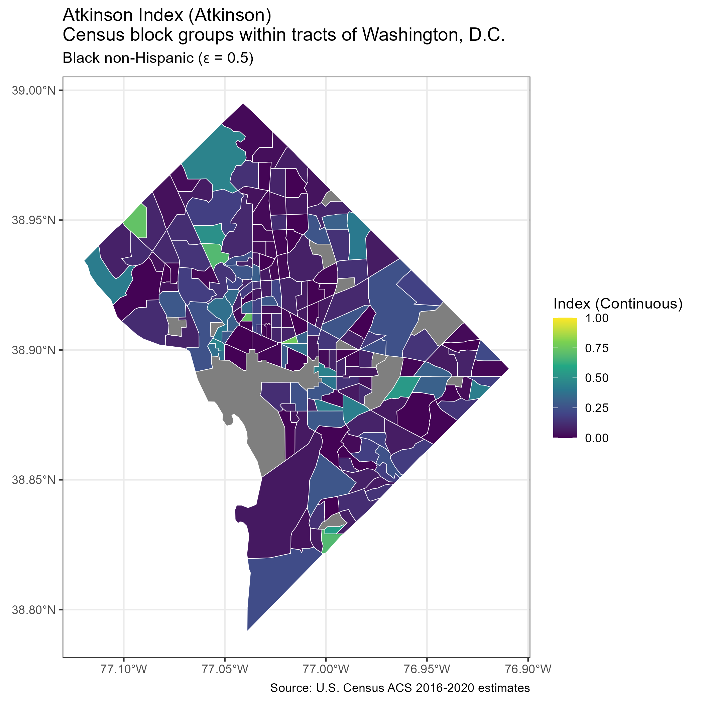

```r
# -------------------------------------------------------------------------------- #
# Compute aspatial racial or ethnic Atkinson Index (Atkinson) with the Hölder mean #
# -------------------------------------------------------------------------------- #

# Atkinson Index based on Atkinson (1970)
## Selected subgroup: Not Hispanic or Latino, Black or African American alone
## Selected large geography: census tract
## Selected small geography: census block group
## Default epsilon (0.5 or over- and under-representation contribute equally)
## Using the Hölder mean based on the `Atkinson()` function from 'DescTools' package
A_2020_DC <- atkinson(
  geo_large = 'tract',
  geo_small = 'cbg',
  state = 'DC',
  year = 2020,
  subgroup = 'NHoLB',
  holder = TRUE
)

# Obtain the 2020 census tracts from the 'tigris' package
tract_2020_DC <- tracts(state = 'DC', year = 2020, cb = TRUE)

# Join the AI (Atkinson) values to the census tract geometry
A_2020_DC <- tract_2020_DC %>%
  left_join(A_2020_DC$a, by = 'GEOID')

ggplot() +
  geom_sf(
    data = A_2020_DC,
    aes(fill = A),
    color = 'white'
  ) +
  theme_bw() +
  scale_fill_viridis_c(limits = c(0, 1)) +
  labs(
    fill = 'Index (Continuous)',
    caption = 'Source: U.S. Census ACS 2016-2020 estimates'
  ) +
  ggtitle(
    'Atkinson Index (Atkinson) with Hölder mean\nCensus block groups within tracts of Washington, D.C.',
    subtitle = expression(paste('Black non-Hispanic (', epsilon, ' = 0.5)'))
  )
ggsave(file.path('man', 'figures', 'a_holder.png'), height = 7, width = 7)
```

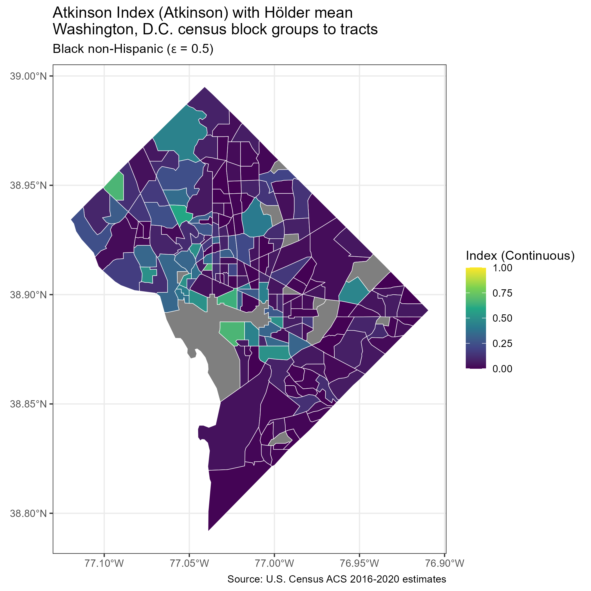

```r
# ---------------------------------------------------------- #
# Compute aspatial racial or ethnic Interaction Index (Bell) #
# ---------------------------------------------------------- #

# Interaction Index based on Shevky & Williams (1949) and Bell (1954)
## Selected subgroup: Not Hispanic or Latino, Black or African American alone
## Selected interaction subgroup: Not Hispanic or Latino, Black or African American alone
## Selected large geography: census tract
## Selected small geography: census block group
xPy_star_2020_DC <- bell(
  geo_large = 'tract',
  geo_small = 'cbg',
  state = 'DC',
  year = 2020,
  subgroup = 'NHoLB',
  subgroup_ixn = 'NHoLW'
)

# Obtain the 2020 census tracts from the 'tigris' package
tract_2020_DC <- tracts(state = 'DC', year = 2020, cb = TRUE)

# Join the xPy* (Bell) values to the census tract geometry
xPy_star_2020_DC <- tract_2020_DC %>%
  left_join(xPy_star_2020_DC$xpy_star, by = 'GEOID')

ggplot() +
  geom_sf(
    data = xPy_star_2020_DC,
    aes(fill = xPy_star),
    color = 'white'
  ) +
  theme_bw() +
  scale_fill_viridis_c(limits = c(0, 1)) +
  labs(
    fill = 'Index (Continuous)',
    caption = 'Source: U.S. Census ACS 2016-2020 estimates'
  ) +
  ggtitle(
    'Interaction Index (Bell)\nCensus block groups within tracts of Washington, D.C.',
    subtitle = 'Black non-Hispanic vs. white non-Hispanic'
  )
ggsave(file.path('man', 'figures', 'xpy_star.png'), height = 7, width = 7)
```

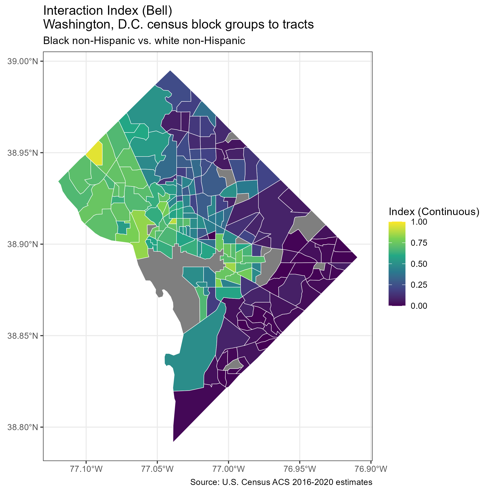

```r
# --------------------------------------------------------------------------------- #
# Compute aspatial racial or ethnic Local Exposure and Isolation (Bemanian & Beyer) #
# --------------------------------------------------------------------------------- #

# Local Exposure and Isolation based on Bemanian & Beyer (2017)
## Selected subgroup: Not Hispanic or Latino, Black or African American alone
## Selected interaction subgroup: Not Hispanic or Latino, Black or African American alone
## Selected large geography: state
## Selected small geography: census tract
LExIs_2020_DC <- bemanian_beyer(
  geo_large = 'state',
  geo_small = 'tract',
  state = 'DC',
  year = 2020,
  subgroup = 'NHoLB',
  subgroup_ixn = 'NHoLW'
)

# Obtain the 2020 census tracts from the 'tigris' package
tract_2020_DC <- tracts(state = 'DC', year = 2020, cb = TRUE)

# Join the LEx/Is (Bemanian & Beyer) values to the census tract geometry
LExIs_2020_DC <- tract_2020_DC %>%
  left_join(LExIs_2020_DC$lexis, by = 'GEOID')

ggplot() +
  geom_sf(
    data = LExIs_2020_DC,
    aes(fill = LExIs),
    color = 'white'
  ) +
  theme_bw() +
  scale_fill_gradient2(
    low = '#998ec3', 
    mid = '#f7f7f7', 
    high = '#f1a340', 
    midpoint = 0
  ) +
  labs(
    fill = 'Index (Continuous)',
    caption = 'Source: U.S. Census ACS 2016-2020 estimates'
  ) +
  ggtitle(
    'Local Exposure and Isolation (Bemanian & Beyer)\nCensus block groups within tracts of Washington, D.C.',
    subtitle = 'Black non-Hispanic vs. white non-Hispanic'
  )
ggsave(file.path('man', 'figures', 'lexis.png'), height = 7, width = 7)
```

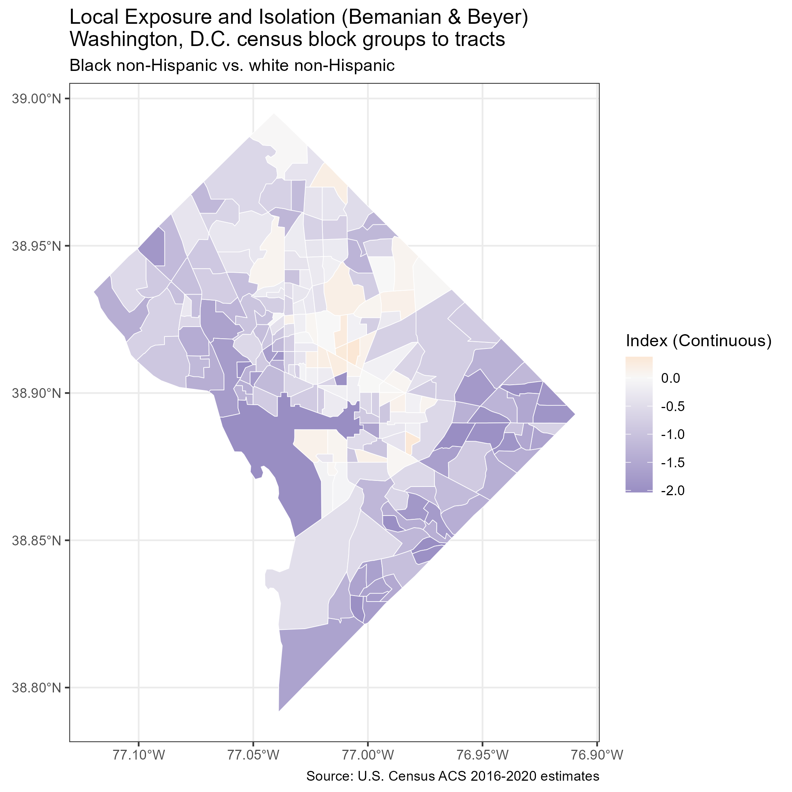

``` r
# ---------------------------------------------------- #
# Compute spatial Educational Isoliation Index (Bravo) #
# ---------------------------------------------------- #

# Educational Isolation Index based on Bravo et al. (2021)
## Selected subgroup: without four-year college degree
EI_2020_DC <- bravo(
  state = 'DC', 
  year = 2020, 
  subgroup = c('LtHS', 'HSGiE', 'SCoAD')
)

# Obtain the 2020 census tracts from the 'tigris' package
tract_2020_DC <- tracts(state = 'DC', year = 2020, cb = TRUE)

# Join the EI (Bravo) values to the census tract geometry
EI_2020_DC <- tract_2020_DC %>% 
  left_join(EI_2020_DC$ei, by = 'GEOID')

ggplot() + 
  geom_sf(
    data = EI_2020_DC, 
    aes(fill = EI),
    color = 'white'
  ) +
  theme_bw() + 
  scale_fill_viridis_c() +
  labs(
    fill = 'Index (Continuous)',
    caption = 'Source: U.S. Census ACS 2016-2020 estimates'
  )+
  ggtitle(
    'Educational Isolation Index\nWithout a four-year college degree (Bravo)',
    subtitle = 'Washington, D.C. tracts (not corrected for edge effects)'
  )
ggsave(file.path('man', 'figures', 'ei.png'), height = 7, width = 7)
```


```r
# ----------------------------------------------------------------------- #
# Compute aspatial racial or ethnic Relative Clustering (Massey & Denton) #
# ----------------------------------------------------------------------- #

# Relative Clustering based on Massey & Denton (1988)
## Selected subgroup: Not Hispanic or Latino, Black or African American alone
## Selected subgroup reference: Not Hispanic or Latino, white alone
## Selected large geography: census tract
## Selected small geography: census block group
RCL_2020_DC <- denton(
  geo_large = 'tract',
  geo_small = 'cbg',
  state = 'DC',
  year = 2020,
  subgroup = 'NHoLB',
  subgroup_ref = 'NHoLW'
)

# Obtain the 2020 census tracts from the 'tigris' package
tract_2020_DC <- tracts(state = 'DC', year = 2020, cb = TRUE)

# Join the RCL (Massey & Denton) values to the census tract geometry
RCL_2020_DC <- tract_2020_DC %>%
  left_join(RCL_2020_DC$rcl, by = 'GEOID')

ggplot() +
  geom_sf(
    data = RCL_2020_DC,
    aes(fill = RCL),
    color = 'white'
  ) +
  theme_bw() +
  scale_fill_gradient2(
    low = '#998ec3', 
    mid = '#f7f7f7', 
    high = '#f1a340', 
    midpoint = 0
  )  +
  labs(
    fill = 'Index (Continuous)',
    caption = 'Source: U.S. Census ACS 2016-2020 estimates'
  ) +
  ggtitle(
    'Relative Clustering (Massey & Denton)\nCensus block groups within tracts of Washington, D.C.',
    subtitle = 'Black non-Hispanic vs. white non-Hispanic'
  )
ggsave(file.path('man', 'figures', 'rcl.png'), height = 7, width = 7)
```

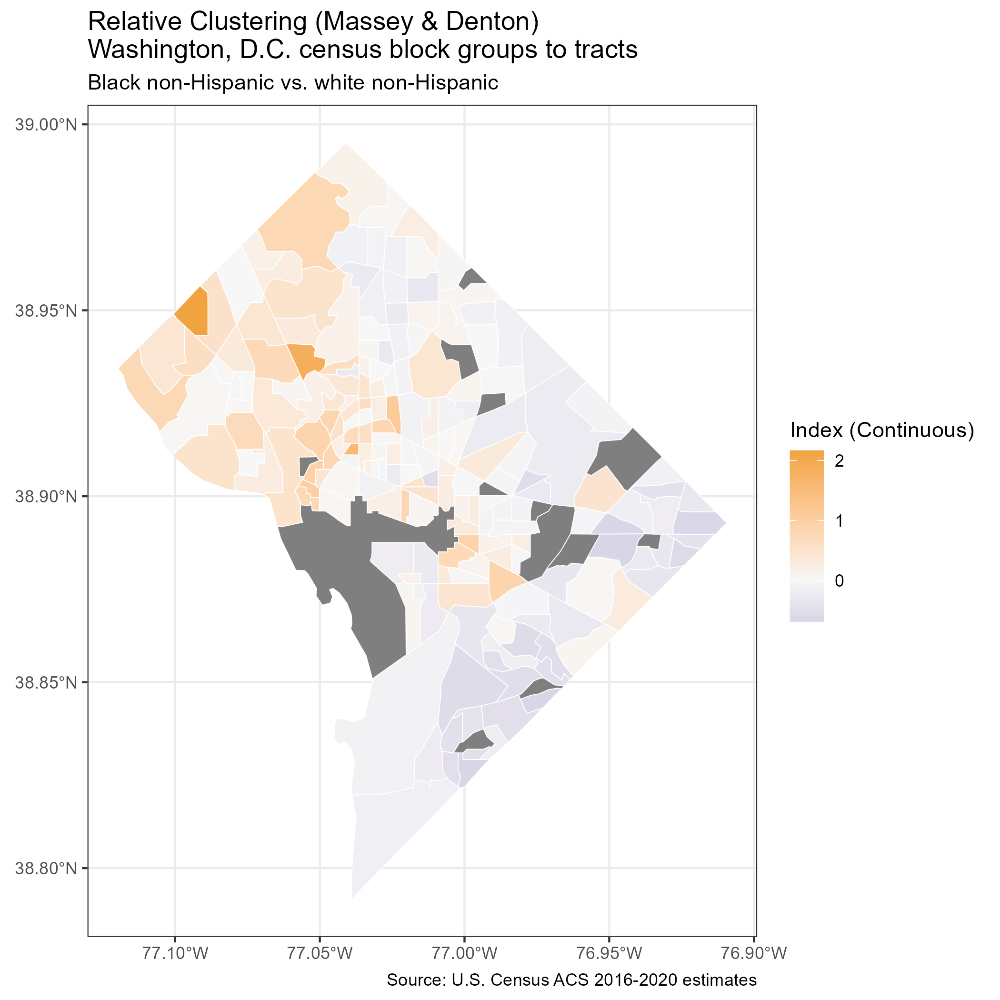

```r
# -------------------------------------------------------------------------- #
# Compute aspatial racial or ethnic Relative Concentration (Massey & Denton) #
# -------------------------------------------------------------------------- #

# Relative Concentration based on Massey & Denton (1988) and Duncan, Cuzzort, & Duncan (1961)
## Selected subgroup: Not Hispanic or Latino, Black or African American alone
## Selected subgroup reference: Not Hispanic or Latino, white alone
## Selected large geography: census tract
## Selected small geography: census block group
RCO_2020_DC <- denton_cuzzort(
  geo_large = 'tract',
  geo_small = 'cbg',
  state = 'DC',
  year = 2020,
  subgroup = 'NHoLB',
  subgroup_ref = 'NHoLW'
)

# Obtain the 2020 census tracts from the 'tigris' package
tract_2020_DC <- tracts(state = 'DC', year = 2020, cb = TRUE)

# Join the RCO (Massey & Denton) values to the census tract geometry
RCO_2020_DC <- tract_2020_DC %>%
  left_join(RCO_2020_DC$rco, by = 'GEOID')

ggplot() +
  geom_sf(
    data = RCO_2020_DC,
    aes(fill = RCO),
    color = 'white'
  ) +
  theme_bw() +
  scale_fill_gradient2(
    low = '#998ec3', 
    mid = '#f7f7f7', 
    high = '#f1a340', 
    midpoint = 0
  ) +
  labs(
    fill = 'Index (Continuous)',
    caption = 'Source: U.S. Census ACS 2016-2020 estimates'
  ) +
  ggtitle(
    'Relative Concentration (Massey & Denton)\nCensus block groups within tracts of Washington, D.C.',
    subtitle = 'Black non-Hispanic vs. white non-Hispanic'
  )
ggsave(file.path('man', 'figures', 'rco.png'), height = 7, width = 7)
```

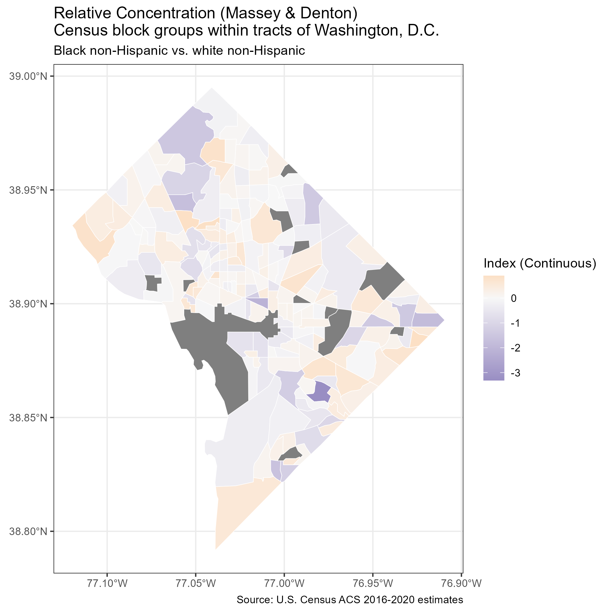

```r
# ----------------------------------------------------------------------- #
# Compute aspatial racial or ethnic Dissimilarity Index (Duncan & Duncan) #
# ----------------------------------------------------------------------- #

# Dissimilarity Index based on Duncan & Duncan (1955a)
## Selected subgroup comparison: Not Hispanic or Latino, Black or African American alone
## Selected subgroup reference: Not Hispanic or Latino, white alone
## Selected large geography: census tract
## Selected small geography: census block group
D_2020_DC <- duncan(
  geo_large = 'tract',
  geo_small = 'cbg',
  state = 'DC',
  year = 2020,
  subgroup = 'NHoLB',
  subgroup_ref = 'NHoLW'
)

# Obtain the 2020 census tracts from the 'tigris' package
tract_2020_DC <- tracts(state = 'DC', year = 2020, cb = TRUE)

# Join the D (Duncan & Duncan) values to the census tract geometry
D_2020_DC <- tract_2020_DC %>%
  left_join(D_2020_DC$d, by = 'GEOID')

ggplot() +
  geom_sf(
    data = D_2020_DC,
    aes(fill = D),
    color = 'white'
  ) +
  theme_bw() +
  scale_fill_viridis_c(limits = c(0, 1)) +
  labs(
    fill = 'Index (Continuous)',
    caption = 'Source: U.S. Census ACS 2016-2020 estimates'
  ) +
  ggtitle(
    'Dissimilarity Index (Duncan & Duncan)\nCensus block groups within tracts of Washington, D.C.',
    subtitle = 'Black non-Hispanic vs. white non-Hispanic'
  )
ggsave(file.path('man', 'figures', 'ddd.png'), height = 7, width = 7)
```

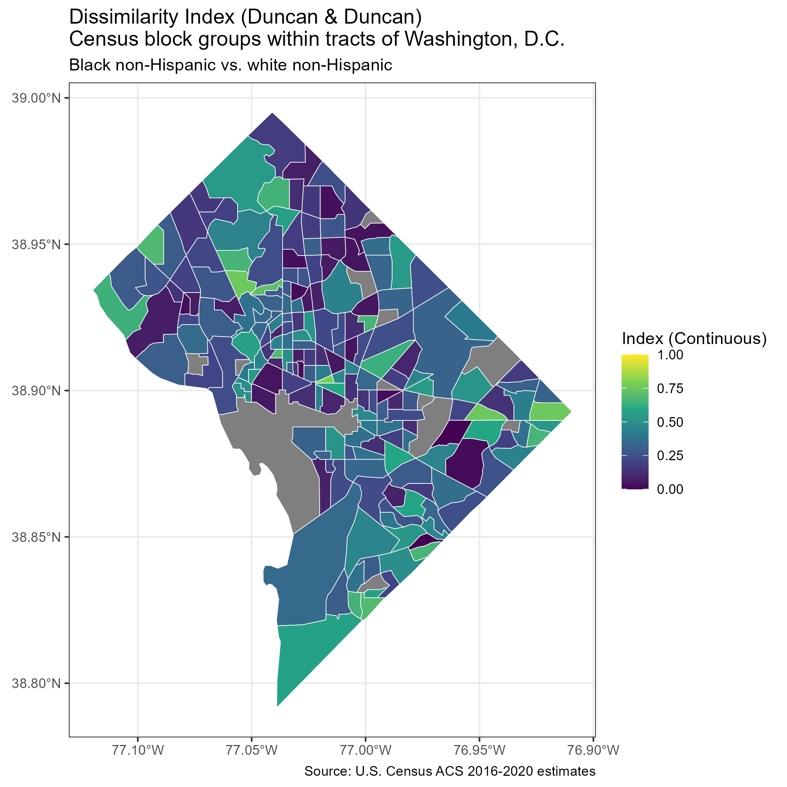

```r
# ---------------------------------------------------------------------------- #
# Compute aspatial racial or ethnic Absolute Centralization (Duncan & Cuzzort) #
# ---------------------------------------------------------------------------- #

# Absolute Centralization based on Duncan, Cuzzort, & Duncan (1961) and Massey & Denton (1988)
## Selected subgroup: Not Hispanic or Latino, Black or African American alone
## Selected large geography: census tract
## Selected small geography: census block group
ACE_2020_DC <- duncan_cuzzort(
  geo_large = 'tract',
  geo_small = 'cbg',
  state = 'DC',
  year = 2020,
  subgroup = 'NHoLB'
)

# Obtain the 2020 census tracts from the 'tigris' package
tract_2020_DC <- tracts(state = 'DC', year = 2020, cb = TRUE)

# Join the ACE (Duncan & Cuzzort) values to the census tract geometry
ACE_2020_DC <- tract_2020_DC %>%
  left_join(ACE_2020_DC$ace, by = 'GEOID')

ggplot() +
  geom_sf(
    data = ACE_2020_DC,
    aes(fill = ACE),
    color = 'white'
  ) +
  theme_bw() +
  scale_fill_gradient2(
    low = '#998ec3', 
    mid = '#f7f7f7', 
    high = '#f1a340', 
    midpoint = 0,
    limits = c(-1, 1)
  )  +
  labs(
    fill = 'Index (Continuous)',
    caption = 'Source: U.S. Census ACS 2016-2020 estimates'
  ) +
  ggtitle(
    'Absolute Centralization (Duncan & Cuzzort)\nCensus block groups within tracts of Washington, D.C.',
    subtitle = 'Black non-Hispanic'
  )
ggsave(file.path('man', 'figures', 'ace.png'), height = 7, width = 7)
```

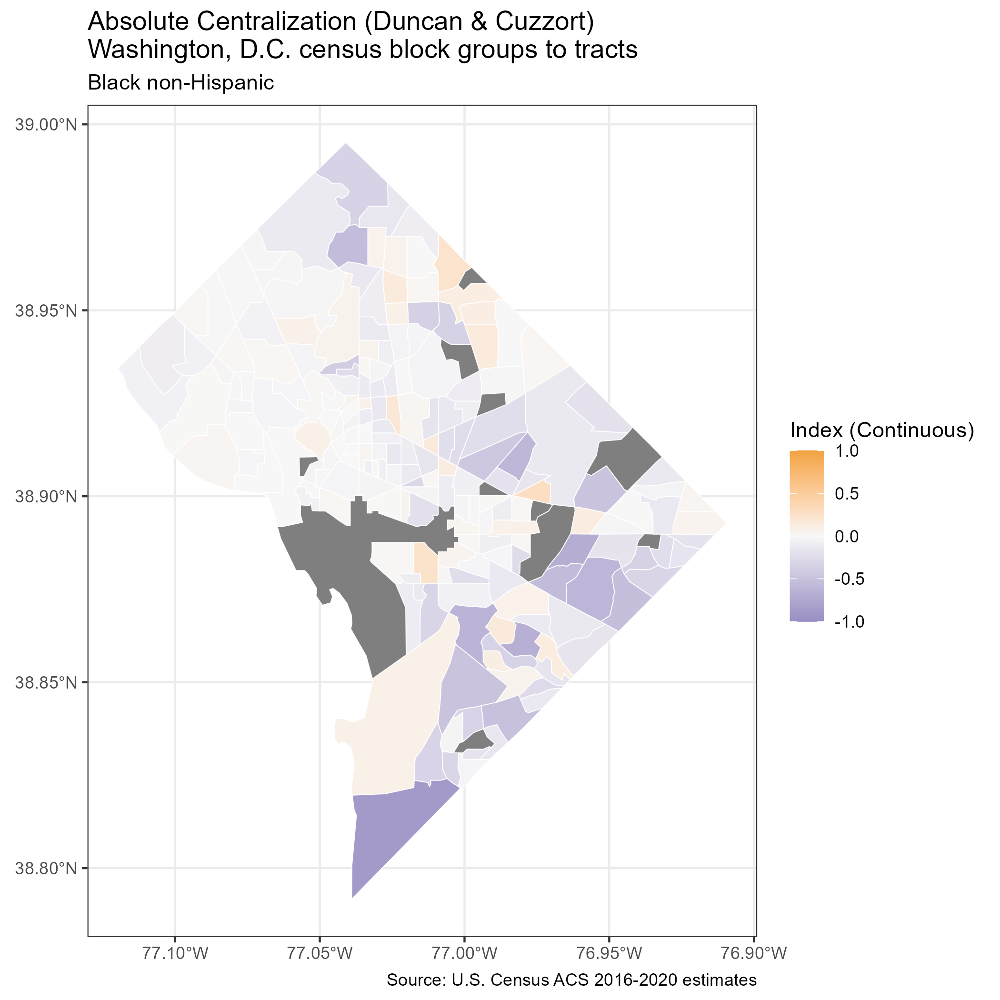

```r
# --------------------------------------------------------------------------- #
# Compute aspatial racial or ethnic Relative Centralization (Duncan & Duncan) #
# --------------------------------------------------------------------------- #

# Relative Centralization based on Duncan & Duncan (1955b) and Massey & Denton (1988)
## Selected subgroup comparison: Not Hispanic or Latino, Black or African American alone
## Selected subgroup reference: Not Hispanic or Latino, white alone
## Selected large geography: census tract
## Selected small geography: census block group
RCE_2020_DC <- duncan_duncan(
  geo_large = 'tract',
  geo_small = 'cbg',
  state = 'DC',
  year = 2020,
  subgroup = 'NHoLB',
  subgroup_ref = 'NHoLW'
)

# Obtain the 2020 census tracts from the 'tigris' package
tract_2020_DC <- tracts(state = 'DC', year = 2020, cb = TRUE)

# Join the ACE (Duncan & Duncan) values to the census tract geometry
RCE_2020_DC <- tract_2020_DC %>%
  left_join(RCE_2020_DC$rce, by = 'GEOID')

ggplot() +
  geom_sf(
    data = RCE_2020_DC,
    aes(fill = RCE),
    color = 'white'
  ) +
  theme_bw() +
  scale_fill_gradient2(
    low = '#998ec3', 
    mid = '#f7f7f7', 
    high = '#f1a340', 
    midpoint = 0,
    limits = c(-1, 1)
  )  +
  labs(
    fill = 'Index (Continuous)',
    caption = 'Source: U.S. Census ACS 2016-2020 estimates'
  ) +
  ggtitle(
    'Relative Centralization (Duncan & Duncan)\nCensus block groups within tracts of Washington, D.C.',
    subtitle = 'Black non-Hispanic vs. white non-Hispanic'
  )
ggsave(file.path('man', 'figures', 'rce.png'), height = 7, width = 7)
```

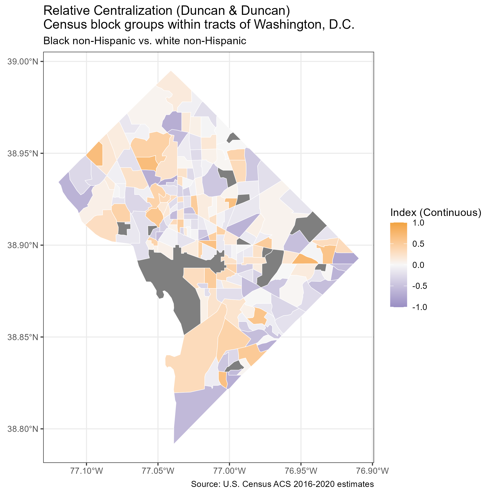

``` r
# -------------------------------------------- #
# Compute aspatial racial or ethnic Gini Index #
# -------------------------------------------- #

# Gini Index based on Gini (1921)
## Selected subgroup: Not Hispanic or Latino, Black or African American alone
## Selected large geography: census tract
## Selected small geography: census block group
G_2020_DC <- gini(
  geo_large = 'tract',
  geo_small = 'cbg',
  state = 'DC',
  year = 2020,
  subgroup = 'NHoLB'
)

# Obtain the 2020 census tracts from the 'tigris' package
tract_2020_DC <- tracts(state = 'DC', year = 2020, cb = TRUE)

# Join the G (Gini) values to the census tract geometry
G_2020_DC <- tract_2020_DC %>%
  left_join(G_2020_DC$g, by = 'GEOID')

ggplot() +
  geom_sf(
    data = G_2020_DC,
    aes(fill = G_re),
    color = 'white'
  ) +
  theme_bw() +
  scale_fill_viridis_c(limits = c(0, 1)) +
  labs(
    fill = 'Index (Continuous)',
    caption = 'Source: U.S. Census ACS 2016-2020 estimates'
  ) +
  ggtitle(
    'Gini Index (Gini)\nCensus block groups within tracts of Washington, D.C.',
    subtitle = 'Black non-Hispanic'
  )
ggsave(file.path('man', 'figures', 'g_re.png'), height = 7, width = 7)
```

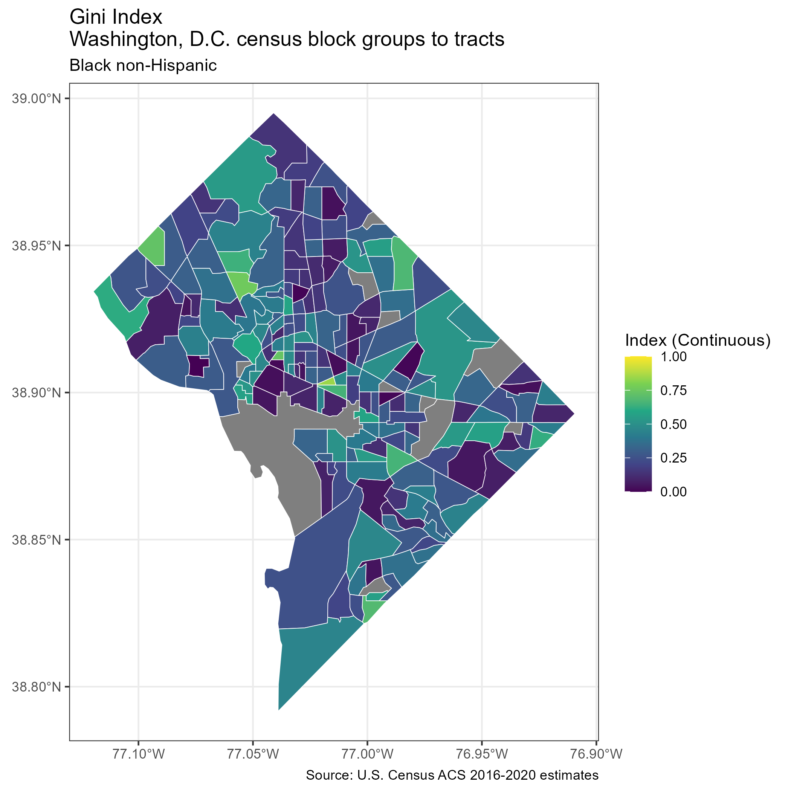

``` r
# ------------------------------------ #
# Retrieve aspatial income Gini Index  #
# ------------------------------------ #

# Gini Index based on Gini (1921)
## Selected subgroup: Not Hispanic or Latino, Black or African American alone
## Selected large geography: county (or district for DC)
## Selected small geography: census tract
G_2020_DC <- gini(
  geo_large = 'county',
  geo_small = 'tract',
  state = 'DC',
  year = 2020,
  subgroup = 'NHoLB'
)

# Obtain the 2020 census tracts from the 'tigris' package
tract_2020_DC <- tracts(state = 'DC', year = 2020, cb = TRUE)

# Join the G (Gini) values found in `g_data` to the census tract geometry
G_2020_DC <- tract_2020_DC %>%
  left_join(G_2020_DC$g_data , by = 'GEOID')

ggplot() +
  geom_sf(
    data = G_2020_DC,
    aes(fill = G_inc),
    color = 'white'
  ) +
  theme_bw() +
  scale_fill_viridis_c() +
  labs(
    fill = 'Index (Continuous)',
    caption = 'Source: U.S. Census ACS 2016-2020 estimates'
  ) +
  ggtitle(
    'Gini Index (Gini)\nCensus block groups within tracts of Washington, D.C.',
    subtitle = 'Income'
  )
ggsave(file.path('man', 'figures', 'g_inc.png'), height = 7, width = 7)
```

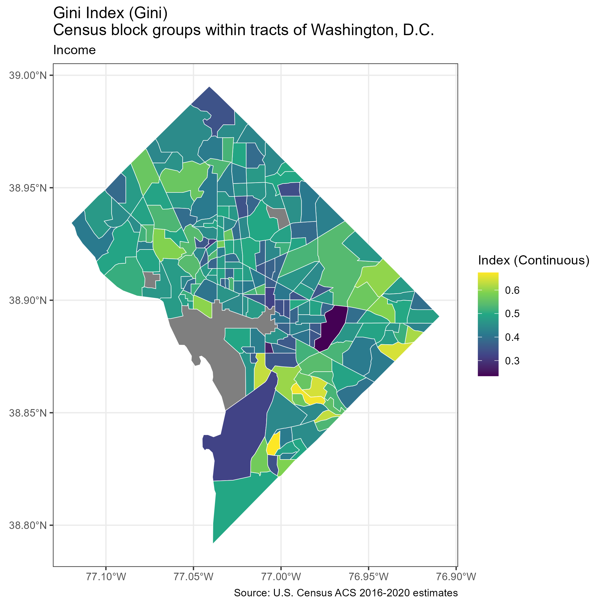

```r
# ------------------------------------------------ #
# Compute aspatial racial or ethnic Delta (Hoover) #
# ------------------------------------------------ #

# Delta based on Hoover (1941) and Duncan, Cuzzort, & Duncan (1961)
## Selected subgroup: Not Hispanic or Latino, Black or African American alone
## Selected large geography: census tract
## Selected small geography: census block group
DEL_2020_DC <- hoover(
  geo_large = 'tract',
  geo_small = 'cbg',
  state = 'DC',
  year = 2020,
  subgroup = 'NHoLB'
)

# Obtain the 2020 census tracts from the 'tigris' package
tract_2020_DC <- tracts(state = 'DC', year = 2020, cb = TRUE)

# Join the DEL (Hoover) values to the census tract geometry
DEL_2020_DC <- tract_2020_DC %>% 
  left_join(DEL_2020_DC$del, by = 'GEOID')

ggplot() +
  geom_sf(
    data = DEL_2020_DC,
    aes(fill = DEL),
    color = 'white'
  ) +
  theme_bw() +
  scale_fill_viridis_c(limits = c(0, 1)) +
  labs(
    fill = 'Index (Continuous)',
    caption = 'Source: U.S. Census ACS 2016-2020 estimates'
  ) +
  ggtitle(
    'Delta (Hoover)\nCensus block groups within tracts of Washington, D.C.',
    subtitle = 'Black non-Hispanic'
  )
ggsave(file.path('man', 'figures', 'del.png'), height = 7, width = 7)
```

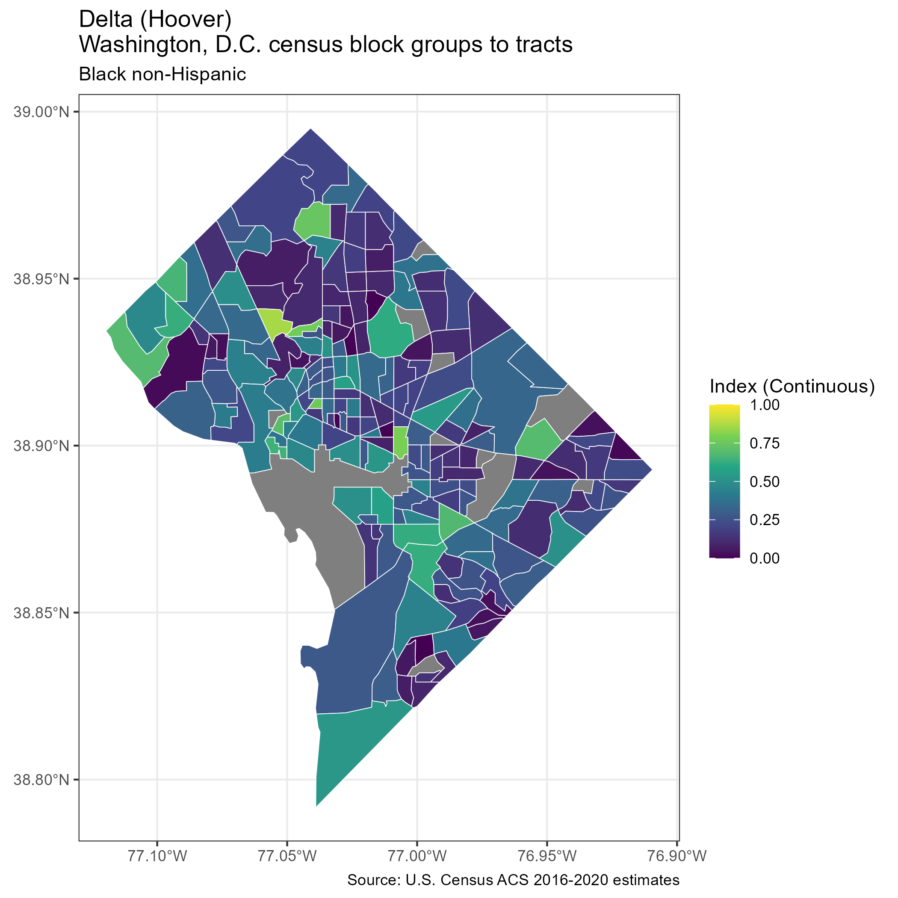

```r
# ----------------------------------------------------------------------- #
# Compute aspatial racial or ethnic Dissimilarity Index (James & Taeuber) #
# ----------------------------------------------------------------------- #

# Dissimilarity Index based on James & Taeuber (1985)
## Selected subgroup comparison: Not Hispanic or Latino, Black or African American alone
## Selected large geography: census tract
## Selected small geography: census block group
D_2020_DC <- james_taeuber(
  geo_large = 'tract',
  geo_small = 'cbg',
  state = 'DC',
  year = 2020,
  subgroup = 'NHoLB'
)

# Obtain the 2020 census tracts from the 'tigris' package
tract_2020_DC <- tracts(state = 'DC', year = 2020, cb = TRUE)

# Join the D (James & Taeuber) values to the census tract geometry
D_2020_DC <- tract_2020_DC %>%
  left_join(D_2020_DC$d, by = 'GEOID')

ggplot() +
  geom_sf(
    data = D_2020_DC,
    aes(fill = D),
    color = 'white'
  ) +
  theme_bw() +
  scale_fill_viridis_c(limits = c(0, 1)) +
  labs(
    fill = 'Index (Continuous)',
    caption = 'Source: U.S. Census ACS 2016-2020 estimates'
  ) +
  ggtitle(
    'Dissimilarity Index (James & Taeuber)\nCensus block groups within tracts of Washington, D.C.',
    subtitle = 'Black non-Hispanic'
  )
ggsave(file.path('man', 'figures', 'djt.png'), height = 7, width = 7)
```

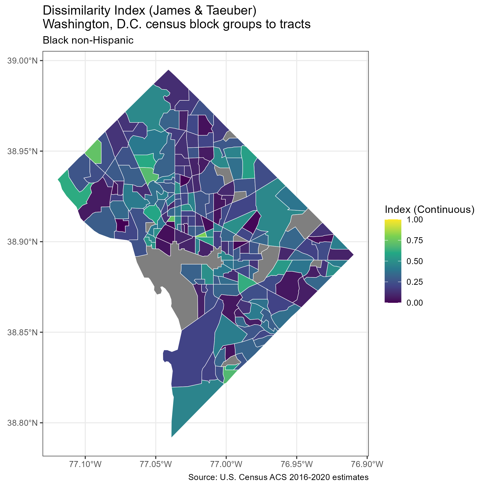

``` r
# ----------------------------------------------------------------- #
# Compute aspatial Index of Concentration at the Extremes (Krieger) #
# ----------------------------------------------------------------- #

# Five Indices of Concentration at the Extremes based on Feldman et al. (2015) and 
# Krieger et al. (2016)

ICE_2020_DC <- krieger(state = 'DC', year = 2020)

# Obtain the 2020 census tracts from the 'tigris' package
tract_2020_DC <- tracts(state = 'DC', year = 2020, cb = TRUE)

# Join the ICEs (Krieger) values to the census tract geometry
ICE_2020_DC <- tract_2020_DC %>%
  left_join(ICE_2020_DC$ice, by = 'GEOID')

# Plot ICE for Income
ggplot() +
  geom_sf(
    data = ICE_2020_DC,
    aes(fill = ICE_inc),
    color = 'white'
  ) +
  theme_bw() +
  scale_fill_gradient2(
    low = '#998ec3',
    mid = '#f7f7f7',
    high = '#f1a340',
    limits = c(-1, 1)
  ) +
  labs(
    fill = 'Index (Continuous)',
    caption = 'Source: U.S. Census ACS 2016-2020 estimates'
  ) +
  ggtitle(
    'Index of Concentration at the Extremes\nIncome (Krieger)',
    subtitle = '80th income percentile vs. 20th income percentile'
  )
```


```r
# Plot ICE for Education
ggplot() +
  geom_sf(
    data = ICE_2020_DC,
    aes(fill = ICE_edu),
    color = 'white'
  ) +
  theme_bw() +
  scale_fill_gradient2(
    low = '#998ec3',
    mid = '#f7f7f7',
    high = '#f1a340',
    limits = c(-1, 1)
  ) +
  labs(
    fill = 'Index (Continuous)',
    caption = 'Source: U.S. Census ACS 2016-2020 estimates'
  ) +
  ggtitle(
    'Index of Concentration at the Extremes\nEducation (Krieger)',
    subtitle = 'less than high school vs. four-year college degree or more'
  )
```


```r
# Plot ICE for Race or Ethnicity
ggplot() +
  geom_sf(
    data = ICE_2020_DC,
    aes(fill = ICE_rewb),
    color = 'white'
  ) +
  theme_bw() +
  scale_fill_gradient2(
    low = '#998ec3',
    mid = '#f7f7f7',
    high = '#f1a340',
    limits = c(-1, 1)
  ) +
  labs(
    fill = 'Index (Continuous)',
    caption = 'Source: U.S. Census ACS 2016-2020 estimates'
  ) +
  ggtitle(
    'Index of Concentration at the Extremes\nRace pr Ethnicity (Krieger)',
    subtitle = 'white non-Hispanic vs. black non-Hispanic'
  )
```


```
# Plot ICE for Income and Race or Ethnicity Combined
## white non-Hispanic in 80th income percentile vs. 
## black (including Hispanic) in 20th income percentile
ggplot() +
  geom_sf(
    data = ICE_2020_DC,
    aes(fill = ICE_wbinc),
    color = 'white'
  ) +
  theme_bw() +
  scale_fill_gradient2(
    low = '#998ec3',
    mid = '#f7f7f7',
    high = '#f1a340',
    limits = c(-1, 1)
  ) +
  labs(
    fill = 'Index (Continuous)',
    caption = 'Source: U.S. Census ACS 2016-2020 estimates'
  ) +
  ggtitle(
    'Index of Concentration at the Extremes\nIncome and race or ethnicity combined (Krieger)',
    subtitle = 'white non-Hispanic in 80th income percentile vs. 
    black (incl. Hispanic) in 20th inc. percentile'
  )
```


```r
# Plot ICE for Income and Race or Ethnicity Combined
## white non-Hispanic in 80th income percentile vs. white non-Hispanic in 20th income percentile
ggplot() +
  geom_sf(
    data = ICE_2020_DC,
    aes(fill = ICE_wpcinc),
    color = 'white'
  ) +
  theme_bw() +
  scale_fill_gradient2(
    low = '#998ec3',
    mid = '#f7f7f7',
    high = '#f1a340',
    limits = c(-1, 1)
  ) +
  labs(
    fill = 'Index (Continuous)',
    caption = 'Source: U.S. Census ACS 2016-2020 estimates'
  ) +
  ggtitle(
    'Index of Concentration at the Extremes\nIncome and race or ethnicity combined (Krieger)',
    subtitle = 'white non-Hispanic in 80th income percentile vs. 
    white non-Hispanic in 20th income percentile'
  )
```


```r
# ------------------------------------------------------------- #
# Compute aspatial racial or ethnic Isolation Index (Lieberson) #
# ------------------------------------------------------------- #

# Isolation Index based on Lieberson (1981) and Bell (1954)
## Selected subgroup: Not Hispanic or Latino, Black or African American alone
## Selected large geography: census tract
## Selected small geography: census block group
xPx_star_2020_DC <- lieberson(
  geo_large = 'tract',
  geo_small = 'cbg',
  state = 'DC',
  year = 2020,
  subgroup = 'NHoLB'
)

# Obtain the 2020 census tracts from the 'tigris' package
tract_2020_DC <- tracts(state = 'DC', year = 2020, cb = TRUE)

# Join the xPx* (Lieberson) values to the census tract geometry
xPx_star_2020_DC <- tract_2020_DC %>%
  left_join(xPx_star_2020_DC$xpx_star, by = 'GEOID')

ggplot() +
  geom_sf(
    data = xPx_star_2020_DC,
    aes(fill = xPx_star),
    color = 'white'
  ) +
  theme_bw() +
  scale_fill_viridis_c(limits = c(0, 1)) +
  labs(
    fill = 'Index (Continuous)',
    caption = 'Source: U.S. Census ACS 2016-2020 estimates'
  ) +
  ggtitle(
    'Isolation Index (Lieberson)\nCensus block groups within tracts of Washington, D.C.',
    subtitle = 'Black non-Hispanic'
  )
ggsave(file.path('man', 'figures', 'xpx_star.png'), height = 7, width = 7)
```

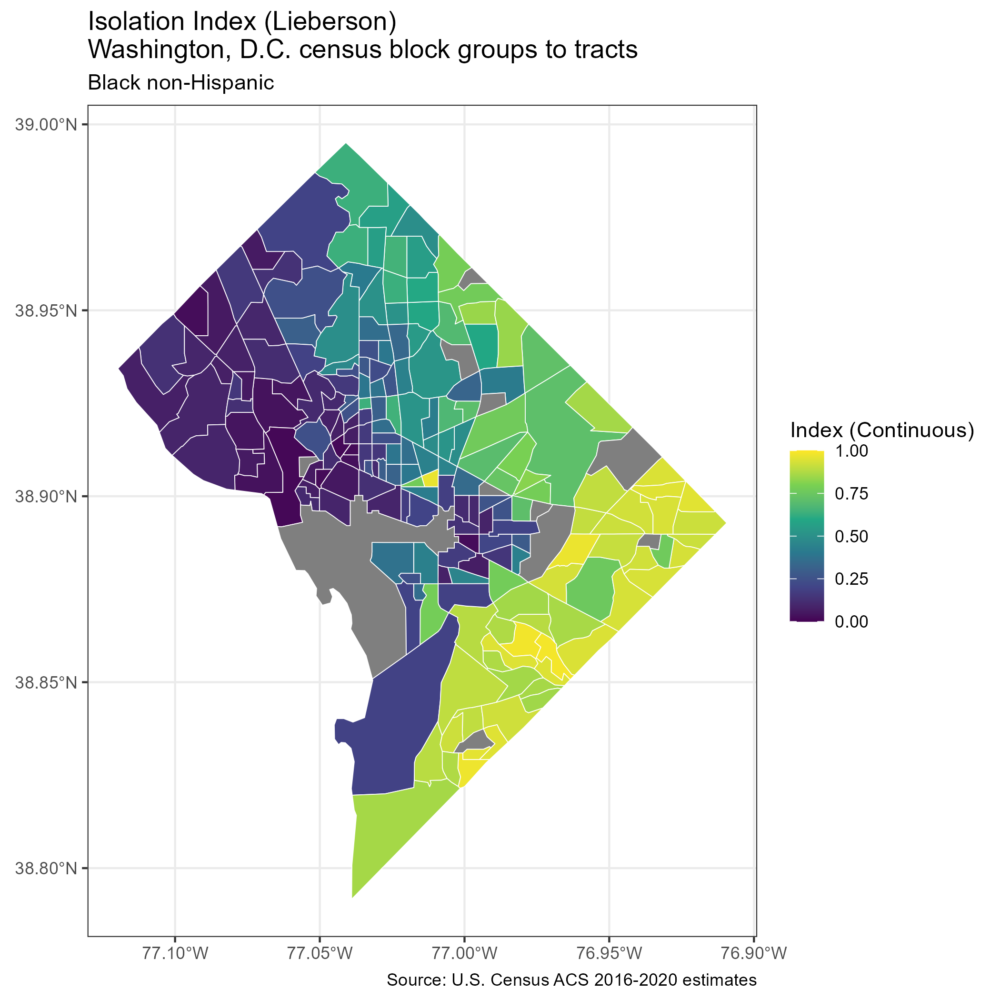

```r
# ----------------------------------------------------------------------- #
# Compute aspatial racial or ethnic Absolute Clustering (Massey & Denton) #
# ----------------------------------------------------------------------- #

# Absolute Clustering based on Massey & Denton (1988)
## Selected subgroup: Not Hispanic or Latino, Black or African American alone
## Selected large geography: census tract
## Selected small geography: census block group
ACL_2020_DC <- massey(
  geo_large = 'tract',
  geo_small = 'cbg',
  state = 'DC',
  year = 2020,
  subgroup = 'NHoLB'
)

# Obtain the 2020 census tracts from the 'tigris' package
tract_2020_DC <- tracts(state = 'DC', year = 2020, cb = TRUE)

# Join the ACL (Massey & Denton) values to the census tract geometry
ACL_2020_DC <- tract_2020_DC %>%
  left_join(ACL_2020_DC$acl, by = 'GEOID')

ggplot() +
  geom_sf(
    data = ACL_2020_DC,
    aes(fill = ACL),
    color = 'white'
  ) +
  theme_bw() +
  scale_fill_gradient2(
    low = '#998ec3', 
    mid = '#f7f7f7', 
    high = '#f1a340', 
    midpoint = 0,
    limits = c(-1, 1)
  )  +
  labs(
    fill = 'Index (Continuous)',
    caption = 'Source: U.S. Census ACS 2016-2020 estimates'
  ) +
  ggtitle(
    'Absolute Clustering (Massey & Denton)\nCensus block groups within tracts of Washington, D.C.',
    subtitle = 'Black non-Hispanic'
  )
ggsave(file.path('man', 'figures', 'acl.png'), height = 7, width = 7)
```

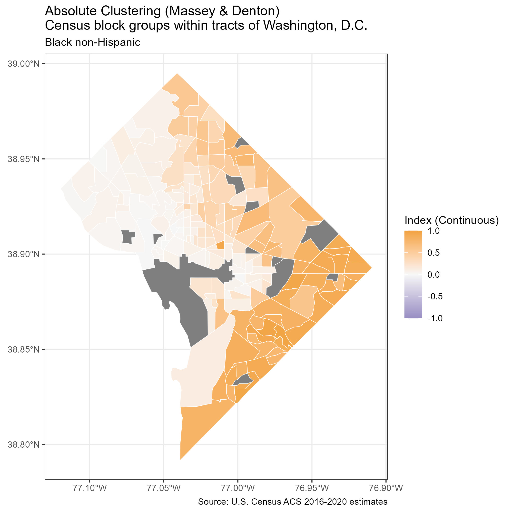

```r
# -------------------------------------------------------------------------- #
# Compute aspatial racial or ethnic Absolute Concentration (Massey & Denton) #
# -------------------------------------------------------------------------- #

# Absolute Concentration based on Massey & Denton (1988) and Duncan, Cuzzort, & Duncan (1961)
## Selected subgroup: Not Hispanic or Latino, Black or African American alone
## Selected large geography: census tract
## Selected small geography: census block group
ACO_2020_DC <- massey_duncan(
  geo_large = 'tract',
  geo_small = 'cbg',
  state = 'DC',
  year = 2020,
  subgroup = 'NHoLB'
)

# Obtain the 2020 census tracts from the 'tigris' package
tract_2020_DC <- tracts(state = 'DC', year = 2020, cb = TRUE)

# Join the ACO (Massey & Denton) values to the census tract geometry
ACO_2020_DC <- tract_2020_DC %>%
  left_join(ACO_2020_DC$aco, by = 'GEOID')

ggplot() +
  geom_sf(
    data = ACO_2020_DC,
    aes(fill = ACO),
    color = 'white'
  ) +
  theme_bw() +
  scale_fill_viridis_c(limits = c(0, 1)) +
  labs(
    fill = 'Index (Continuous)',
    caption = 'Source: U.S. Census ACS 2016-2020 estimates'
  ) +
  ggtitle(
    'Absolute Concentration (Massey & Denton)\nCensus block groups within tracts of Washington, D.C.',
    subtitle = 'Black non-Hispanic'
  )
ggsave(file.path('man', 'figures', 'aco.png'), height = 7, width = 7)
```

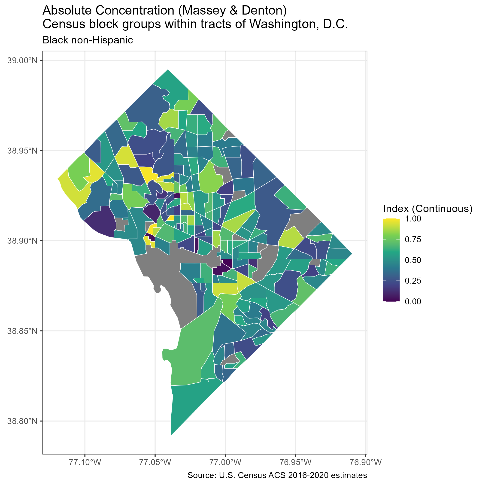

```r
# --------------------------------------------------------------------------- #
# Compute aspatial racial or ethnic Distance-Decay Interaction Index (Morgan) #
# --------------------------------------------------------------------------- #

# Distance-Decay Interaction Index based on Morgan (1983) and Massey & Denton (1988)
## Selected subgroup: Not Hispanic or Latino, Black or African American alone
## Selected interaction subgroup: Not Hispanic or Latino, Black or African American alone
## Selected large geography: census tract
## Selected small geography: census block group
DPxy_star_2020_DC <- morgan_denton(
  geo_large = 'tract',
  geo_small = 'cbg',
  state = 'DC',
  year = 2020,
  subgroup = 'NHoLB',
  subgroup_ixn = 'NHoLW'
)

# Obtain the 2020 census tracts from the 'tigris' package
tract_2020_DC <- tracts(state = 'DC', year = 2020, cb = TRUE)

# Join the DPxx* (Morgan) values to the census tract geometry
DPxy_star_2020_DC <- tract_2020_DC %>%
  left_join(DPxy_star_2020_DC$dpxy_star, by = 'GEOID')

ggplot() +
  geom_sf(
    data = DPxy_star_2020_DC,
    aes(fill = DPxy_star),
    color = 'white'
  ) +
  theme_bw() +
  scale_fill_viridis_c(limits = c(0, 1)) +
  labs(
    fill = 'Index (Continuous)',
    caption = 'Source: U.S. Census ACS 2016-2020 estimates'
  ) +
  ggtitle(
    'Distance-Decay Interaction Index (Morgan)\nCensus block groups within tracts of Washington, D.C.',
    subtitle = 'Black non-Hispanic vs. white non-Hispanic'
  )
ggsave(file.path('man', 'figures', 'dpxy_star.png'), height = 7, width = 7)
```

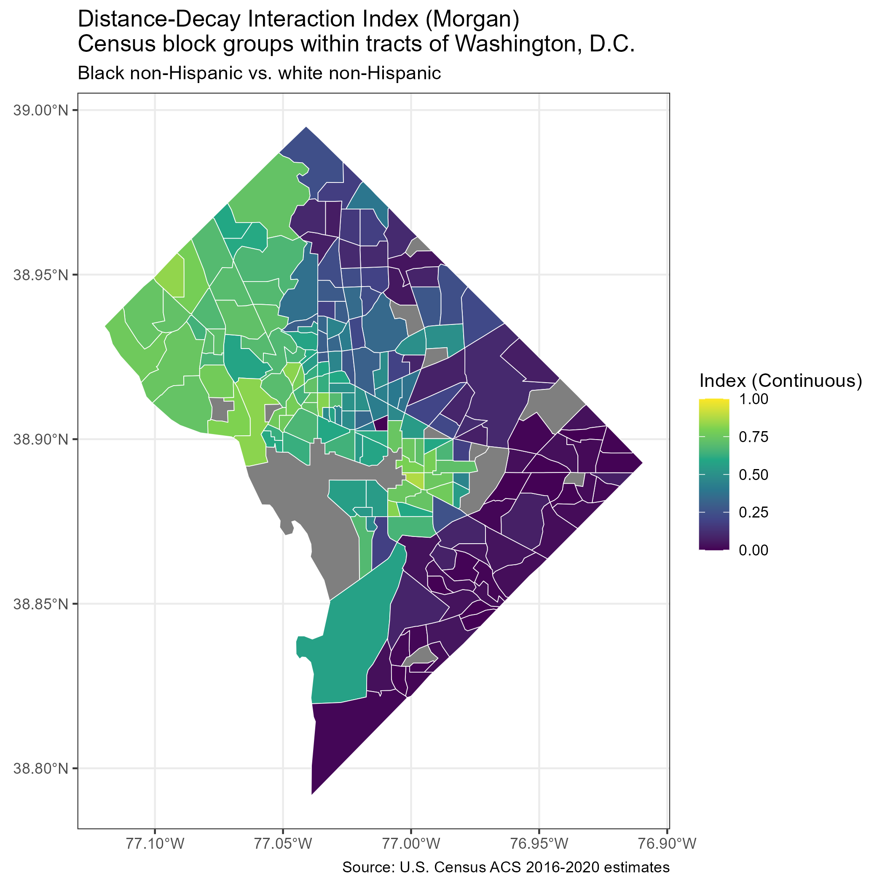

```r
# ------------------------------------------------------------------------- #
# Compute aspatial racial or ethnic Distance-Decay Isolation Index (Morgan) #
# ------------------------------------------------------------------------- #

# Distance-Decay Isolation Index based on Morgan (1983) and Massey & Denton (1988)
## Selected subgroup: Not Hispanic or Latino, Black or African American alone
## Selected large geography: census tract
## Selected small geography: census block group
DPxx_star_2020_DC <- morgan_massey(
  geo_large = 'tract',
  geo_small = 'cbg',
  state = 'DC',
  year = 2020,
  subgroup = 'NHoLB'
)

# Obtain the 2020 census tracts from the 'tigris' package
tract_2020_DC <- tracts(state = 'DC', year = 2020, cb = TRUE)

# Join the DPxx* (Morgan) values to the census tract geometry
DPxx_star_2020_DC <- tract_2020_DC %>%
  left_join(DPxx_star_2020_DC$dpxx_star, by = 'GEOID')

ggplot() +
  geom_sf(
    data = DPxx_star_2020_DC,
    aes(fill = DPxx_star),
    color = 'white'
  ) +
  theme_bw() +
  scale_fill_viridis_c(limits = c(0, 1)) +
  labs(
    fill = 'Index (Continuous)',
    caption = 'Source: U.S. Census ACS 2016-2020 estimates'
  ) +
  ggtitle(
    'Distance-Decay Isolation Index (Morgan)\nCensus block groups within tracts of Washington, D.C.',
    subtitle = 'Black non-Hispanic'
  )
ggsave(file.path('man', 'figures', 'dpxx_star.png'), height = 7, width = 7)
```

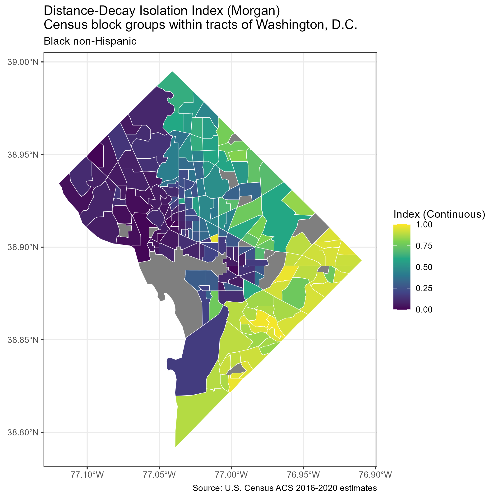

```r
# ------------------------------------------------------------ #
# Compute aspatial racial or ethnic Location Quotient (Sudano) #
# ------------------------------------------------------------ #

# Location Quotient based on Merton (1938) and Sudano (2013)
## Selected subgroup: Not Hispanic or Latino, Black or African American alone
## Selected large geography: state
## Selected small geography: census tract
LQ_2020_DC <- sudano(
  geo_large = 'state',
  geo_small = 'tract',
  state = 'DC',
  year = 2020,
  subgroup = 'NHoLB'
)

# Obtain the 2020 census tracts from the 'tigris' package
tract_2020_DC <- tracts(state = 'DC', year = 2020, cb = TRUE)

# Join the LQ (Sudano) values to the census tract geometry
LQ_2020_DC <- tract_2020_DC %>%
  left_join(LQ_2020_DC$lq, by = 'GEOID')

ggplot() +
  geom_sf(
    data = LQ_2020_DC,
    aes(fill = LQ),
    color = 'white'
  ) +
  theme_bw() +
  scale_fill_viridis_c() +
  labs(
    fill = 'Index (Continuous)',
    caption = 'Source: U.S. Census ACS 2016-2020 estimates'
  ) +
  ggtitle(
    'Location Quotient (Sudano)\nCensus tracts within "state"" of Washington, D.C.',
    subtitle = 'Black non-Hispanic'
  )
ggsave(file.path('man', 'figures', 'lq.png'), height = 7, width = 7)
```

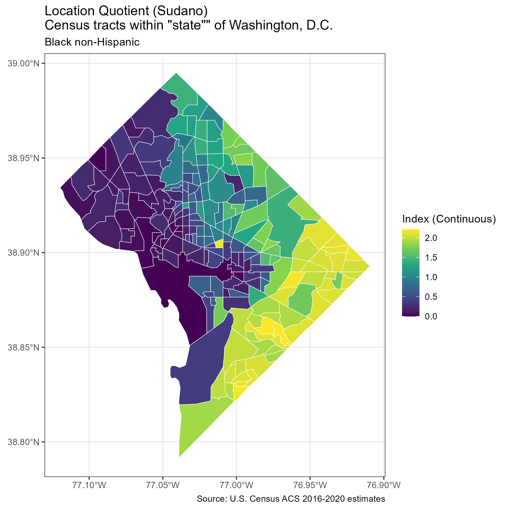

```r
# ------------------------------------------------- #
# Compute aspatial racial or ethnic Entropy (Theil) #
# ------------------------------------------------- #

# Entropy based on Theil (1972) and Theil & Finizza (1971)
## Selected subgroup: Not Hispanic or Latino, Black or African American alone
## Selected large geography: census tract
## Selected small geography: census block group
H_2020_DC <- theil(
  geo_large = 'tract',
  geo_small = 'cbg',
  state = 'DC',
  year = 2020,
  subgroup = 'NHoLB'
)

# Obtain the 2020 census tracts from the 'tigris' package
tract_2020_DC <- tracts(state = 'DC', year = 2020, cb = TRUE)

# Join the H (Theil) values to the census tract geometry
H_2020_DC <- tract_2020_DC %>%
  left_join(H_2020_DC$h, by = 'GEOID')

ggplot() +
  geom_sf(
    data = H_2020_DC,
    aes(fill = H),
    color = 'white'
  ) +
  theme_bw() +
  scale_fill_viridis_c(limits = c(0, 1)) +
  labs(
    fill = 'Index (Continuous)',
    caption = 'Source: U.S. Census ACS 2016-2020 estimates'
  ) +
  ggtitle(
    'Entropy (Theil)\nCensus block groups within tracts of Washington, D.C.',
    subtitle = 'Black non-Hispanic'
  )
ggsave(file.path('man', 'figures', 'h.png'), height = 7, width = 7)
```

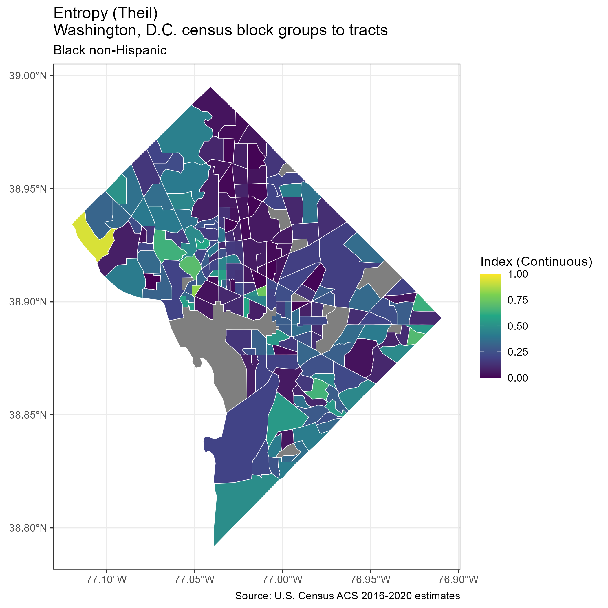

```r
# ----------------------------------------------------------- #
# Compute aspatial racial or ethnic Correlation Ratio (White) #
# ----------------------------------------------------------- #

# Correlation Ratio based on Bell (1954) and White (1986)
## Selected subgroup: Not Hispanic or Latino, Black or African American alone
## Selected large geography: census tract
## Selected small geography: census block group
V_2020_DC <- white(
  geo_large = 'tract',
  geo_small = 'cbg',
  state = 'DC',
  year = 2020,
  subgroup = 'NHoLB'
)

# Obtain the 2020 census tracts from the 'tigris' package
tract_2020_DC <- tracts(state = 'DC', year = 2020, cb = TRUE)

# Join the V (White) values to the census tract geometry
V_2020_DC <- tract_2020_DC %>%
  left_join(V_2020_DC$v, by = 'GEOID')

ggplot() +
  geom_sf(
    data = V_2020_DC,
    aes(fill = V),
    color = 'white'
  ) +
  theme_bw() +
  scale_fill_viridis_c() +
  labs(
    fill = 'Index (Continuous)',
    caption = 'Source: U.S. Census ACS 2016-2020 estimates'
  ) +
  ggtitle(
    'Correlation Ratio (White)\nCensus block groups within tracts of Washington, D.C.',
    subtitle = 'Black non-Hispanic'
  )
ggsave(file.path('man', 'figures', 'v.png'), height = 7, width = 7)
```

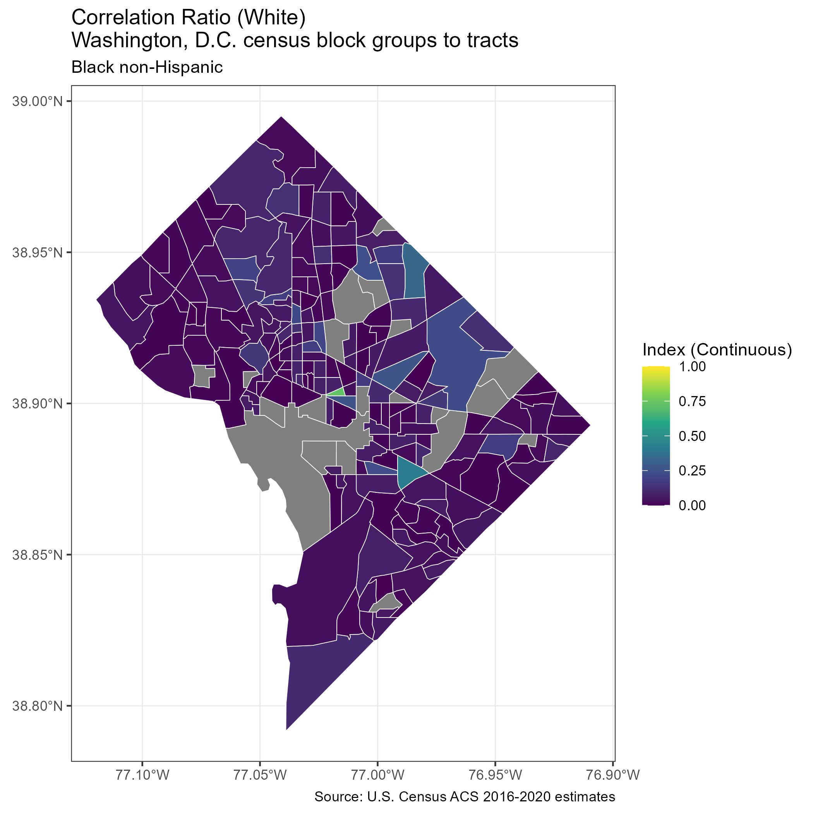

```r
# ------------------------------------------------------------- #
# Compute a racial or ethnic index of spatial proximity (White) #
# ------------------------------------------------------------- #

# An index of spatial proximity based on White (1986) & Blau (1977) 
## Selected subgroup: Not Hispanic or Latino, Black or African American alone
## Selected large geography: census tract
## Selected small geography: census block group
SP_2020_DC <- white_blau(
  geo_large = 'tract',
  geo_small = 'cbg',
  state = 'DC',
  year = 2020,
  subgroup = 'NHoLB',
  subgroup_ref = 'NHoLW'
)

# Obtain the 2020 census tracts from the 'tigris' package
tract_2020_DC <- tracts(state = 'DC', year = 2020, cb = TRUE)

# Join the SP (White) values to the census tract geometry
SP_2020_DC <- tract_2020_DC %>%
  left_join(SP_2020_DC$sp, by = 'GEOID')

ggplot() +
  geom_sf(
    data = SP_2020_DC,
    aes(fill = SP),
    color = 'white'
  ) +
  theme_bw() +
  scale_fill_gradient2(
    low = '#998ec3', 
    mid = '#f7f7f7', 
    high = '#f1a340', 
    midpoint = 1
  ) +
  labs(
    fill = 'Index (Continuous)',
    caption = 'Source: U.S. Census ACS 2016-2020 estimates'
  ) +
  ggtitle(
    'An index of spatial proximity (White)\nCensus block groups within tracts of Washington, D.C.',
    subtitle = 'Black non-Hispanic vs. white non-Hispanic'
  )
ggsave(file.path('man', 'figures', 'sp.png'), height = 7, width = 7)
```

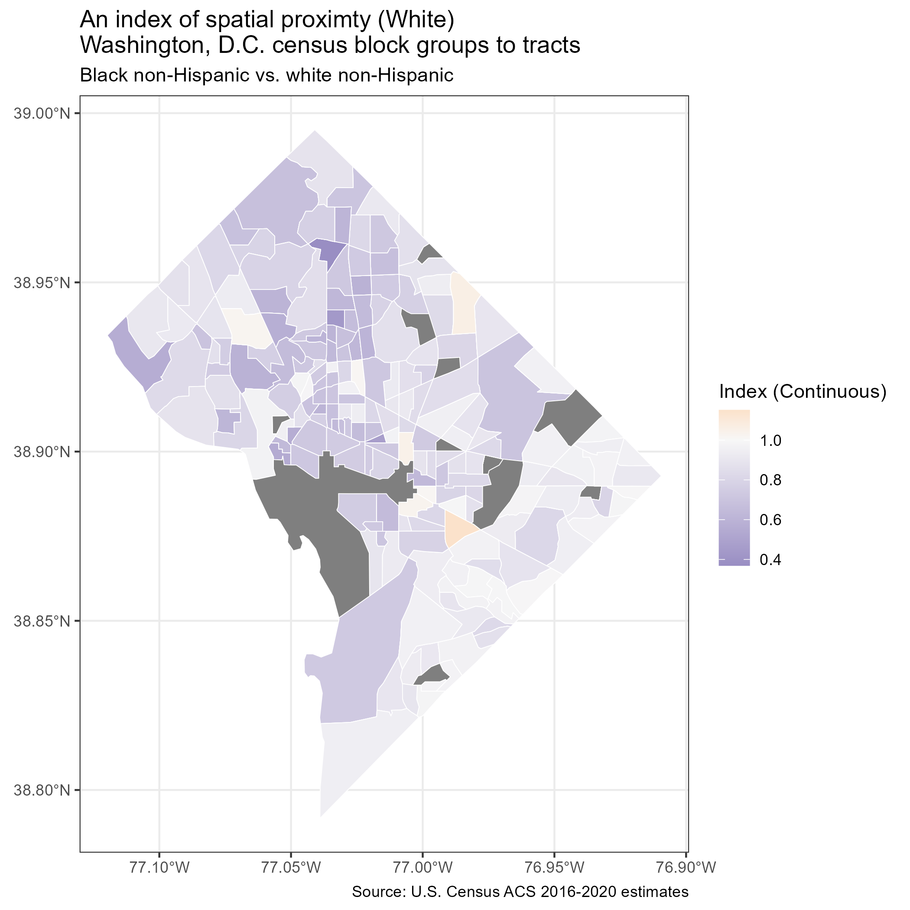

### Funding

This package was originally developed while the author was a postdoctoral fellow supported by the [Cancer Prevention Fellowship Program](https://cpfp.cancer.gov) at the [National Cancer Institute](https://www.cancer.gov). Any modifications since December 05, 2022 were made while the author was an employee of [DLH, LLC](https://www.dlhcorp.com) (formerly Social & Scientific Systems, Inc. and DLH Corporation).

### Acknowledgments

The [`messer()`](R/messer.R) function functionalizes the code found in [Hruska et al. (2022)](https://doi.org/10.1016/j.janxdis.2022.102529) available on an [OSF repository](https://doi.org/10.17605/OSF.IO/M2SAV), but with percent with income less than $30K added to the computation based on [Messer et al. (2006)](https://doi.org/10.1007/s11524-006-9094-x). The [`messer()`](R/messer.R) function also allows for the computation of *NDI* (Messer) for each year between 2010-2020 (when the U.S. census characteristics are available to date). There was no code companion to compute *NDI* (Powell-Wiley) included in [Andrews et al. (2020)](https://doi.org/10.1080/17445647.2020.1750066) or [Slotman et al. (2022)](https://doi.org/10.1016/j.dib.2022.108002) only a [description](https://www.gis.cancer.gov/research/NeighDeprvIndex_Methods.pdf), but the package author worked directly with the latter manuscript authors to replicate their [*SAS*](https://www.sas.com) code in [**R**](https://cran.r-project.org/) for the [`powell_wiley()`](R/powell_wiley.R) function. See the Accumulating Data to Optimally Predict Obesity Treatment [(ADOPT)](https://gis.cancer.gov/research/adopt.html) Core Measures Project for more details. Please note: the *NDI* (Powell-Wiley) values will not exactly match (but will highly correlate with) those found in [Andrews et al. (2020)](https://doi.org/10.1080/17445647.2020.1750066) and [Slotman et al. (2022)](https://doi.org/10.1016/j.dib.2022.108002) because the two studies used a different statistical platform (i.e., [*SPSS*](https://www.ibm.com/spss) and [*SAS*](https://www.sas.com), respectively) that intrinsically calculate the principal component analysis differently from [**R**](https://cran.r-project.org/). The internal function to calculate the Atkinson Index with the Hölder mean is based on the `Atkinson()` function in the [*DescTools*](https://cran.r-project.org/package=DescTools) package.

When citing this package for publication, please follow:

    citation('ndi')

### Questions? Feedback?

For questions about the package, please contact the maintainer [Dr. Ian D. Buller](mailto:ian.buller@alumni.emory.edu) or [submit a new issue](https://github.com/idblr/ndi/issues). Confirmation of the computation, feedback, and feature collaboration is welcomed, especially from the authors of the references cited above.
