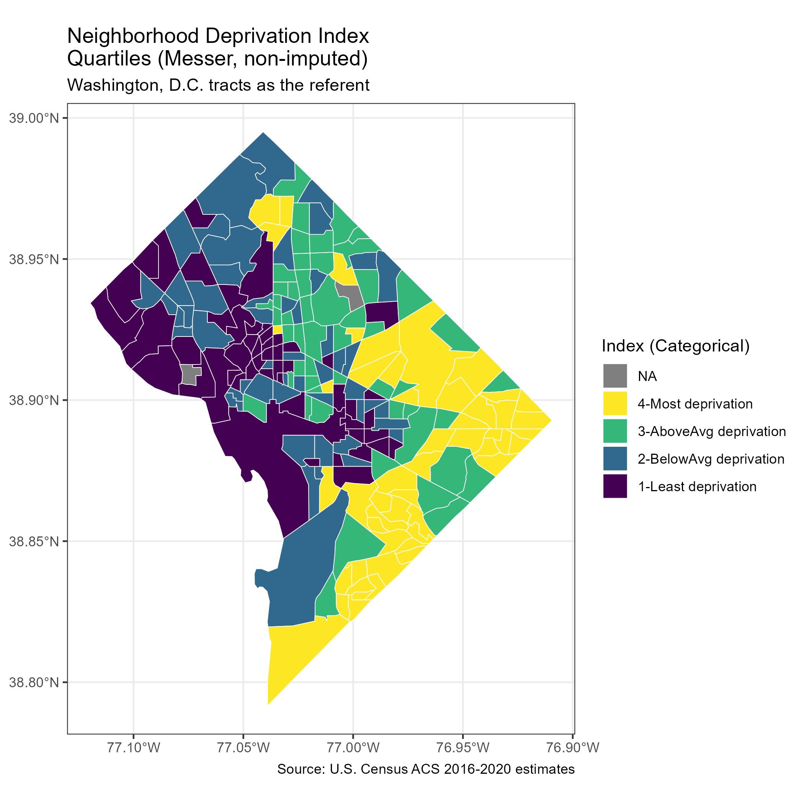
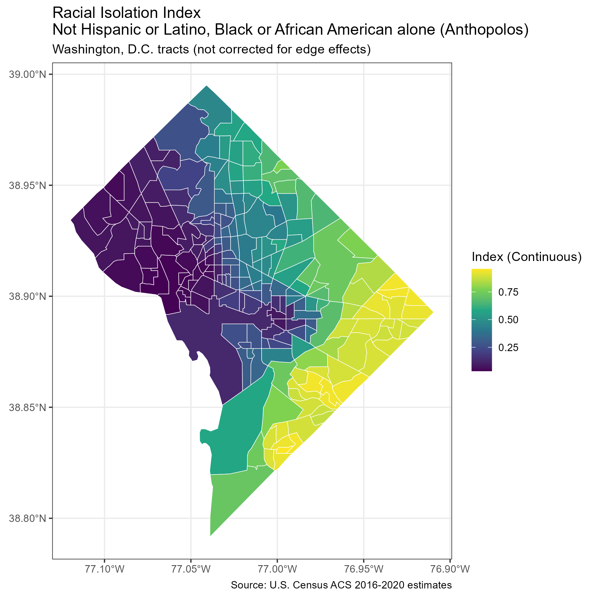
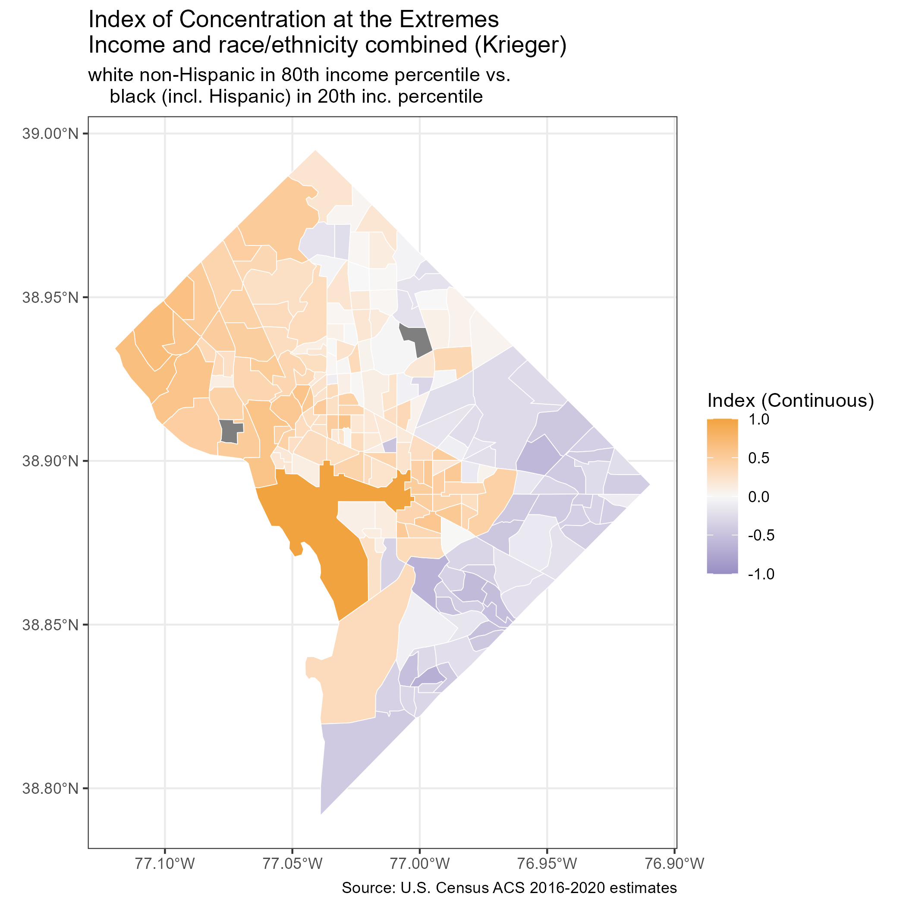

ndi: Neighborhood Deprivation Indices 
===================================================

<!-- badges: start -->
[](https://cran.r-project.org/package=ndi)
[](https://cran.r-project.org/package=ndi)
[](https://r-pkg.org/pkg/ndi)
[](https://opensource.org/licenses/Apache-2.0)

[](https://zenodo.org/badge/latestdoi/521439746)
<!-- badges: end -->

**Date repository last updated**: December 02, 2022

### Overview

The `ndi` package is a suite of `R` functions to compute various metrics of socio-economic deprivation and disparity in the United States. Some metrics are considered "spatial" because they consider the values of neighboring (i.e., adjacent) census geographies in their computation, while other metrics are "aspatial" because they only consider the value within each census geography. Two types of aspatial NDI are available: (1) based on [Messer et al. (2006)](https://doi.org/10.1007/s11524-006-9094-x) and (2) based on [Andrews et al. (2020)](https://doi.org/10.1080/17445647.2020.1750066) and [Slotman et al. (2022)](https://doi.org/10.1016/j.dib.2022.108002) who use variables chosen by [Roux and Mair (2010)](https://doi.org/10.1111/j.1749-6632.2009.05333.x). Both are a decomposition of various demographic characteristics from the U.S. Census Bureau American Community Survey 5-year estimates (ACS-5; 2006-2010 onward) pulled by the [tidycensus](https://CRAN.R-project.org/package=tidycensus) package. Using data from the ACS-5 (2005-2009 onward), the `ndi` package can also (1) compute the spatial Racial Isolation Index (RI) based on [Anthopolos et al. (2011)](https://www.doi.org/10.1016/j.sste.2011.06.002), (2) compute the spatial Educational Isolation Index (EI) based on [Bravo et al. (2021)](https://www.doi.org/10.3390/ijerph18179384), (3) compute the aspatial Index of Concentration at the Extremes (ICE) based on [Feldman et al. (2015)](https://www.doi.org/10.1136/jech-2015-205728) and [Krieger et al. (2016)](https://www.doi.org/10.2105/AJPH.2015.302955), (4) compute the aspatial Dissimilarity Index (DI) based on [Duncan & Duncan (1955)](https://doi.org/10.2307/2088328), and (5) retrieve the aspatial Gini Index based on [Gini (1921)](https://www.doi.org/10.2307/2223319).

### Installation

To install the release version from CRAN:

    install.packages("ndi")

To install the development version from GitHub:

    devtools::install_github("idblr/ndi")

### Available functions

<table>
<colgroup>
<col width="30%" />
<col width="70%" />
</colgroup>
<thead>
<tr class="header">
<th>Function</th>
<th>Description</th>
</tr>
</thead>
<tbody>
<td><code>anthopolos</code></td>
<td>Compute the Racial Isolation Index (RI) based on <a href="https://www.doi.org/10.1016/j.sste.2011.06.002">Anthopolos et al. (2011)</a></td>
</tr>
<td><code>bravo</code></td>
<td>Compute the Educational Isolation Index (EI) based on <a href="https://www.doi.org/10.3390/ijerph18179384">Bravo et al. (2021)</a></td>
</tr>
<td><code>duncan</code></td>
<td>Compute the Dissimilarity Index (DI) based on <a href="https://doi.org/10.2307/2088328">Duncan & Duncan (1955)</a></td>
</tr>
<td><code>gini</code></td>
<td>Retrieve the Gini Index based on <a href="https://www.doi.org/10.2307/2223319">Gini (1921)</a></td>
</tr>
<td><code>krieger</code></td>
<td>Compute the Index of Concentration at the Extremes (ICE) based on <a href="https://www.doi.org/10.1136/jech-2015-205728">Feldman et al. (2015)</a> and <a href="https://www.doi.org/10.2105/AJPH.2015.302955">Krieger et al. (2016)</a></td>
</tr>
<td><code>messer</code></td>
<td>Compute the Neighboorhood Deprivation Index (NDI) based on <a href="https://doi.org/10.1007/s11524-006-9094-x">Messer et al. (2006)</a></td>
</tr>
<td><code>powell_wiley</code></td>
<td>Compute the Neighboorhood Deprivation Index (NDI) based on <a href="https://doi.org/10.1080/17445647.2020.1750066">Andrews et al. (2020)</a> and <a href="https://doi.org/10.1016/j.dib.2022.108002">Slotman et al. (2022)</a> with variables chosen by <a href="https://doi.org/10.1111/j.1749-6632.2009.05333.x">Roux and Mair (2010)</a></td>
</tr>
</tbody>
<table>

The repository also includes the code to create the project hexagon sticker.

<h2 id="available-data">

### Available sample dataset

</h2>

<table>
<colgroup>
<col width="30%" />
<col width="70%" />
</colgroup>
<thead>
<tr class="header">
<th>Data</th>
<th>Description</th>
</tr>
</thead>
<tbody>
<td><code>DCtracts2020</code></td>
<td>A sample dataset containing information about U.S. Census American Community Survey 5-year estimate data for the District of Columbia census tracts (2020). The data are obtained from the <a href="https://cran.r-project.org/package=tidycensus">tidycensus</a> package and formatted for the <code>messer()</code> and <code>powell_wiley()</code> functions input.</td>
</tr>
</tbody>
<table>

### Author

* **Ian D. Buller** - *Occupational and Environmental Epidemiology Branch, Division of Cancer Epidemiology and Genetics, National Cancer Institute, National Institutes of Health, Rockville, Maryland* - [GitHub](https://github.com/idblr) - [ORCID](https://orcid.org/0000-0001-9477-8582)

See also the list of [contributors](https://github.com/idblr/ndi/graphs/contributors) who participated in this package, including:

* **Jacob Englert** - *Biostatistics and Bioinformatics Doctoral Program, Laney Graduate School, Emory University, Atlanta, Georgia* - [GitHub](https://github.com/jacobenglert)

* **Chris Prener** - *Real World Evidence Center of Excellence, Pfizer, Inc.* - [GitHub](https://github.com/chris-prener) - [ORCID](https://orcid.org/0000-0002-4310-9888)

* **Jessica Gleason** - *Epidemiology Branch, Division of Population Health Research, Eunice Kennedy Shriver National Institute of Child Health and Human Development, National Institutes of Health, Bethesda, Maryland* - [ORCID](https://orcid.org/0000-0001-9877-7931)

Thank you to those who suggested additional metrics, including:

* **Jessica Madrigal** - *Occupational and Environmental Epidemiology Branch, Division of Cancer Epidemiology and Genetics, National Cancer Institute, National Institutes of Health, Rockville, Maryland* - [ORCID](https://orcid.org/0000-0001-5303-5109)

* **David Berrigan** - *Behavioral Research Program, Division of Cancer Control and Population Sciences, National Cancer Institute, National Institutes of Health, Rockville, Maryland* - [ORCID](https://orcid.org/0000-0002-5333-179X)

### Getting Started

* Step 1: Obtain a unique access key from the U.S. Census Bureau. Follow [this link](http://api.census.gov/data/key_signup.html) to obtain one.
* Step 2: Specify your access key in the `anthopolos()`, `bravo()`, `duncan()`, `gini()`, `krieger()`, `messer()`, or `powell_wiley()` functions using the internal `key` argument or by using the `census_api_key()` function from the `tidycensus` package before running the `anthopolos()`, `bravo()`, `duncan()`, `gini()`, `krieger()`, `messer()`, or `powell_wiley()` functions (see an example below).

### Usage

``` r
# ------------------ #
# Necessary packages #
# ------------------ #

library(ndi)
library(ggplot2)
library(sf) # dependency fo the "ndi" package
library(tidycensus) # a dependency for the "ndi" package
library(tigris)

# -------- #
# Settings #
# -------- #

## Access Key for census data download
### Obtain one at http://api.census.gov/data/key_signup.html
tidycensus::census_api_key("...") # INSERT YOUR OWN KEY FROM U.S. CENSUS API

# ---------------------- #
# Calculate NDI (Messer) #
# ---------------------- #

# Compute the NDI (Messer) values (2016-2020 5-year ACS) for Washington, D.C. census tracts
messer2020DC <- ndi::messer(state = "DC", year = 2020)

# ------------------------------ #
# Outputs from messer() function #
# ------------------------------ #

# A tibble containing the identification, geographic name, NDI (Messer) values, NDI (Messer) quartiles, and raw census characteristics for each tract
messer2020DC$ndi

# The results from the principal component analysis used to compute the NDI (Messer) values
messer2020DC$pca

# A tibble containing a breakdown of the missingingness of the census characteristics used to compute the NDI (Messer) values
messer2020DC$missing

# -------------------------------------- #
# Visualize the messer() function output #
# -------------------------------------- #

# Obtain the 2020 census tracts from the "tigris" package
tract2020DC <- tigris::tracts(state = "DC", year = 2020, cb = TRUE)

# Join the NDI (Messer) values to the census tract geometry
DC2020messer <- dplyr::left_join(tract2020DC, messer2020DC$ndi, by = "GEOID")

# Visualize the NDI (Messer) values (2016-2020 5-year ACS) for Washington, D.C. census tracts

## Continuous Index
ggplot2::ggplot() + 
  ggplot2::geom_sf(data = DC2020messer, 
                   ggplot2::aes(fill = NDI),
                   color = "white") +
  ggplot2::theme_bw() +  
  ggplot2::scale_fill_viridis_c() +
  ggplot2::labs(fill = "Index (Continuous)",
                caption = "Source: U.S. Census ACS 2016-2020 estimates")+
  ggplot2::ggtitle("Neighborhood Deprivation Index\nContinuous (Messer, non-imputed)",
                   subtitle = "Washington, D.C. tracts as the referent")

## Categorical Index (Quartiles)
### Rename "9-NDI not avail" level as NA for plotting
DC2020messer$NDIQuartNA <- factor(replace(as.character(DC2020messer$NDIQuart),
                                          DC2020messer$NDIQuart == "9-NDI not avail",
                                          NA),
                                  c(levels(DC2020messer$NDIQuart)[-5], NA))

ggplot2::ggplot() + 
  ggplot2::geom_sf(data = DC2020messer, 
                   ggplot2::aes(fill = NDIQuartNA),
                   color = "white") +
  ggplot2::theme_bw() + 
  ggplot2::scale_fill_viridis_d(guide = ggplot2::guide_legend(reverse = TRUE),
                                na.value = "grey50") +
  ggplot2::labs(fill = "Index (Categorical)",
                caption = "Source: U.S. Census ACS 2016-2020 estimates") +
  ggplot2::ggtitle("Neighborhood Deprivation Index\nQuartiles (Messer, non-imputed)",
                   subtitle = "Washington, D.C. tracts as the referent")
```



``` r
# ---------------------------- #
# Calculate NDI (Powell-Wiley) #
# ---------------------------- #

# Compute the NDI (Powell-Wiley) values (2016-2020 5-year ACS) for Washington, D.C. census tracts
powell_wiley2020DC <- powell_wiley(state = "DC", year = 2020)
powell_wiley2020DCi <- powell_wiley(state = "DC", year = 2020, imp = TRUE) # impute missing values

# ------------------------------------ #
# Outputs from powell_wiley() function #
# ------------------------------------ #

# A tibble containing the identification, geographic name, NDI (Powell-Wiley) value, and raw census characteristics for each tract
powell_wiley2020DC$ndi

# The results from the principal component analysis used to compute the NDI (Powell-Wiley) values
powell_wiley2020DC$pca

# A tibble containing a breakdown of the missingingness of the census characteristics used to compute the NDI (Powell-Wiley) values
powell_wiley2020DC$missing

# -------------------------------------------- #
# Visualize the powell_wiley() function output #
# -------------------------------------------- #

# Obtain the 2020 census tracts from the "tigris" package
tract2020DC <- tigris::tracts(state = "DC", year = 2020, cb = TRUE)

# Join the NDI (powell_wiley) values to the census tract geometry
DC2020powell_wiley <- dplyr::left_join(tract2020DC, powell_wiley2020DC$ndi, by = "GEOID")
DC2020powell_wiley <- dplyr::left_join(DC2020powell_wiley, powell_wiley2020DCi$ndi, by = "GEOID")

# Visualize the NDI (Powell-Wiley) values (2016-2020 5-year ACS) for Washington, D.C. census tracts

## Non-imputed missing tracts (Continuous)
ggplot2::ggplot() + 
  ggplot2::geom_sf(data = DC2020powell_wiley, 
                   ggplot2::aes(fill = NDI.x),
                   color = "white") +
  ggplot2::theme_bw() + 
  ggplot2::scale_fill_viridis_c() +
  ggplot2::labs(fill = "Index (Continuous)",
                caption = "Source: U.S. Census ACS 2016-2020 estimates")+
  ggplot2::ggtitle("Neighborhood Deprivation Index\nContinuous (Powell-Wiley, non-imputed)",
                   subtitle = "Washington, D.C. tracts as the referent")

## Non-imputed missing tracts (Categorical quintiles)
### Rename "9-NDI not avail" level as NA for plotting
DC2020powell_wiley$NDIQuintNA.x <- factor(replace(as.character(DC2020powell_wiley$NDIQuint.x),
                                                  DC2020powell_wiley$NDIQuint.x == "9-NDI not avail",
                                                  NA),
                                          c(levels(DC2020powell_wiley$NDIQuint.x)[-6], NA))

ggplot2::ggplot() + 
  ggplot2::geom_sf(data = DC2020powell_wiley, 
                   ggplot2::aes(fill = NDIQuintNA.x),
                   color = "white") +
  ggplot2::theme_bw() + 
  ggplot2::scale_fill_viridis_d(guide = ggplot2::guide_legend(reverse = TRUE),
                                na.value = "grey50") +
  ggplot2::labs(fill = "Index (Categorical)",
                caption = "Source: U.S. Census ACS 2016-2020 estimates")+
  ggplot2::ggtitle("Neighborhood Deprivation Index\nPopulation-weighted Quintiles (Powell-Wiley, non-imputed)",
                   subtitle = "Washington, D.C. tracts as the referent")
```


``` r
## Imputed missing tracts (Continuous)
ggplot2::ggplot() + 
  ggplot2::geom_sf(data = DC2020powell_wiley, 
                   ggplot2::aes(fill = NDI.y),
                   color = "white") +
  ggplot2::theme_bw() + 
  ggplot2::scale_fill_viridis_c() +
  ggplot2::labs(fill = "Index (Continuous)",
                caption = "Source: U.S. Census ACS 2016-2020 estimates")+
  ggplot2::ggtitle("Neighborhood Deprivation Index\nContinuous (Powell-Wiley, imputed)",
                   subtitle = "Washington, D.C. tracts as the referent")

## Imputed missing tracts (Categorical quintiles)
### Rename "9-NDI not avail" level as NA for plotting
DC2020powell_wiley$NDIQuintNA.y <- factor(replace(as.character(DC2020powell_wiley$NDIQuint.y), 
                                                  DC2020powell_wiley$NDIQuint.y == "9-NDI not avail",
                                                  NA), 
                                          c(levels(DC2020powell_wiley$NDIQuint.y)[-6], NA))

ggplot2::ggplot() + 
  ggplot2::geom_sf(data = DC2020powell_wiley, 
                   ggplot2::aes(fill = NDIQuintNA.y),
                   color = "white") +
  ggplot2::theme_bw() + 
  ggplot2::scale_fill_viridis_d(guide = ggplot2::guide_legend(reverse = TRUE),
                                na.value = "grey50") +
  ggplot2::labs(fill = "Index (Categorical)",
                caption = "Source: U.S. Census ACS 2016-2020 estimates")+
  ggplot2::ggtitle("Neighborhood Deprivation Index\nPopulation-weighted Quintiles (Powell-Wiley, imputed)",
                   subtitle = "Washington, D.C. tracts as the referent")
```


``` r
# --------------------------- #
# Compare the two NDI metrics #
# --------------------------- #

# Merge the two NDI metrics (Messer and Powell-Wiley, imputed)
ndi2020DC <- dplyr::left_join(messer2020DC$ndi, powell_wiley2020DCi$ndi, by = "GEOID", suffix = c(".messer", ".powell_wiley"))

# Check the correlation the two NDI metrics (Messer and Powell-Wiley, imputed) as continuous values
cor(ndi2020DC$NDI.messer, ndi2020DC$NDI.powell_wiley, use = "complete.obs") # Pearsons r = 0.975

# Check the similarity of the two NDI metrics (Messer and Powell-Wiley, imputed) as quartiles
table(ndi2020DC$NDIQuart, ndi2020DC$NDIQuint)
```

``` r
# ------------------- #
# Retrieve Gini Index #
# ------------------- #

# Gini Index based on Gini (1921) from the ACS-5
gini2020DC <- gini(state = "DC", year = 2020)

# Obtain the 2020 census tracts from the "tigris" package
tract2020DC <- tigris::tracts(state = "DC", year = 2020, cb = TRUE)

# Join the Gini Index values to the census tract geometry
gini2020DC <- dplyr::left_join(tract2020DC, gini2020DC$gini, by = "GEOID")

ggplot2::ggplot() + 
  ggplot2::geom_sf(data = gini2020DC, 
                   ggplot2::aes(fill = gini),
                   color = "white") +
  ggplot2::theme_bw() + 
  ggplot2::scale_fill_viridis_c() +
  ggplot2::labs(fill = "Index (Continuous)",
                caption = "Source: U.S. Census ACS 2016-2020 estimates")+
  ggplot2::ggtitle("Gini Index\nGrey color denotes no data",
                   subtitle = "Washington, D.C. tracts")
```


``` r
# -------------------------------------------- #
# Compute Racial Isoliation Index (Anthopolos) #
# -------------------------------------------- #

# Racial Isolation Index based on Anthopolos et al. (2011)
## Selected subgroup: Not Hispanic or Latino, Black or African American alone
ri2020DC <- anthopolos(state = "DC", year = 2020, subgroup = "NHoLB")

# Obtain the 2020 census tracts from the "tigris" package
tract2020DC <- tigris::tracts(state = "DC", year = 2020, cb = TRUE)

# Join the RI (Anthopolos) values to the census tract geometry
ri2020DC <- dplyr::left_join(tract2020DC, ri2020DC$ri, by = "GEOID")

ggplot2::ggplot() + 
  ggplot2::geom_sf(data = ri2020DC, 
                   ggplot2::aes(fill = RI),
                   color = "white") +
  ggplot2::theme_bw() + 
  ggplot2::scale_fill_viridis_c() +
  ggplot2::labs(fill = "Index (Continuous)",
                caption = "Source: U.S. Census ACS 2016-2020 estimates")+
  ggplot2::ggtitle("Racial Isolation Index\nNot Hispanic or Latino, Black or African American alone (Anthopolos)",
                   subtitle = "Washington, D.C. tracts (not corrected for edge effects)")
```



``` r
# -------------------------------------------- #
# Compute Educational Isoliation Index (Bravo) #
# -------------------------------------------- #

# Educational Isolation Index based on Bravo et al. (2021)
## Selected subgroup: without four-year college degree
ei2020DC <- bravo(state = "DC", year = 2020, subgroup = c("LtHS", "HSGiE", "SCoAD"))

# Obtain the 2020 census tracts from the "tigris" package
tract2020DC <- tigris::tracts(state = "DC", year = 2020, cb = TRUE)

# Join the EI (Bravo) values to the census tract geometry
ei2020DC <- dplyr::left_join(tract2020DC, ei2020DC$ei, by = "GEOID")

ggplot2::ggplot() + 
  ggplot2::geom_sf(data = ei2020DC, 
                   ggplot2::aes(fill = EI),
                   color = "white") +
  ggplot2::theme_bw() + 
  ggplot2::scale_fill_viridis_c() +
  ggplot2::labs(fill = "Index (Continuous)",
                caption = "Source: U.S. Census ACS 2016-2020 estimates")+
  ggplot2::ggtitle("Educational Isolation Index\nWithout a four-year college degree (Bravo)",
                   subtitle = "Washington, D.C. tracts (not corrected for edge effects)")
```


``` r
# ------------------------------------------------ #
# Index of Concentration at the Extremes (Krieger) #
# ------------------------------------------------ #

# Five Indices of Concentration at the Extremes based on Feldman et al. (2015) and Krieger et al. (2016)

ice2020DC <- krieger(state = "DC", year = 2020)

# Obtain the 2020 census tracts from the "tigris" package
tract2020DC <- tigris::tracts(state = "DC", year = 2020, cb = TRUE)

# Join the ICEs (Krieger) values to the census tract geometry
ice2020DC <- dplyr::left_join(tract2020DC, ice2020DC$ice, by = "GEOID")

# Plot ICE for Income
ggplot2::ggplot() + 
  ggplot2::geom_sf(data = ice2020DC, 
                   ggplot2::aes(fill = ICE_inc),
                   color = "white") +
  ggplot2::theme_bw() + 
  ggplot2::scale_fill_gradient2(low = "#998ec3", mid = "#f7f7f7", high = "#f1a340", limits = c(-1,1)) +
  ggplot2::labs(fill = "Index (Continuous)",
                caption = "Source: U.S. Census ACS 2016-2020 estimates")+
  ggplot2::ggtitle("Index of Concentration at the Extremes\nIncome (Krieger)",
                   subtitle = "80th income percentile vs. 20th income percentile")
```


```r
# Plot ICE for Education
ggplot2::ggplot() + 
  ggplot2::geom_sf(data = ice2020DC, 
                   ggplot2::aes(fill = ICE_edu),
                   color = "white") +
  ggplot2::theme_bw() + 
  ggplot2::scale_fill_gradient2(low = "#998ec3", mid = "#f7f7f7", high = "#f1a340", limits = c(-1,1)) +
  ggplot2::labs(fill = "Index (Continuous)",
                caption = "Source: U.S. Census ACS 2016-2020 estimates")+
  ggplot2::ggtitle("Index of Concentration at the Extremes\nEducation (Krieger)",
                   subtitle = "less than high school vs. four-year college degree or more")
```


```r
# Plot ICE for Race/Ethnicity
ggplot2::ggplot() + 
  ggplot2::geom_sf(data = ice2020DC, 
                   ggplot2::aes(fill = ICE_rewb),
                   color = "white") +
  ggplot2::theme_bw() + 
  ggplot2::scale_fill_gradient2(low = "#998ec3", mid = "#f7f7f7", high = "#f1a340", limits = c(-1, 1)) +
  ggplot2::labs(fill = "Index (Continuous)",
                caption = "Source: U.S. Census ACS 2016-2020 estimates")+
  ggplot2::ggtitle("Index of Concentration at the Extremes\nRace/Ethnicity (Krieger)",
                   subtitle = "white non-Hispanic vs. black non-Hispanic")
```


```
# Plot ICE for Income and Race/Ethnicity Combined
## white non-Hispanic in 80th income percentile vs. black (including Hispanic) in 20th income percentile
ggplot2::ggplot() + 
  ggplot2::geom_sf(data = ice2020DC, 
                   ggplot2::aes(fill = ICE_wbinc),
                   color = "white") +
  ggplot2::theme_bw() + 
  ggplot2::scale_fill_gradient2(low = "#998ec3", mid = "#f7f7f7", high = "#f1a340", limits = c(-1, 1)) +
  ggplot2::labs(fill = "Index (Continuous)",
                caption = "Source: U.S. Census ACS 2016-2020 estimates")+
  ggplot2::ggtitle("Index of Concentration at the Extremes\nIncome and race/ethnicity combined (Krieger)",
                   subtitle = "white non-Hispanic in 80th income percentile vs. black (incl. Hispanic) in 20th inc. percentile")
```



```r
# Plot ICE for Income and Race/Ethnicity Combined
## white non-Hispanic in 80th income percentile vs. white non-Hispanic in 20th income percentile
ggplot2::ggplot() + 
  ggplot2::geom_sf(data = ice2020DC, 
                   ggplot2::aes(fill = ICE_wpcinc),
                   color = "white") +
  ggplot2::theme_bw() + 
  ggplot2::scale_fill_gradient2(low = "#998ec3", mid = "#f7f7f7", high = "#f1a340", limits = c(-1, 1)) +
  ggplot2::labs(fill = "Index (Continuous)",
                caption = "Source: U.S. Census ACS 2016-2020 estimates")+
  ggplot2::ggtitle("Index of Concentration at the Extremes\nIncome and race/ethnicity combined (Krieger)",
                   subtitle = "white non-Hispanic in 80th income percentile vs. white non-Hispanic in 20th income percentile")
```


```r
# ------------------------------------ #
# Compute Dissimilarity Index (Duncan) #
# ------------------------------------ #

# Dissimilarity Index based on Duncan & Duncan (1955)
## Selected subgroup comparison: Not Hispanic or Latino, Black or African American alone
## Selected subgroup reference: Not Hispanic or Latino, white alone
## Selected large geography: census tract
## Selected small geography: census block group
di2020DC <- duncan(geo_large = "tract", geo_small = "block group",
                   state = "DC", year = 2020,
                   subgroup = "NHoLB", subgroup_ref = "NHoLW")

# Obtain the 2020 census tracts from the "tigris" package
tract2020DC <- tigris::tracts(state = "DC", year = 2020, cb = TRUE)

# Join the DI (Duncan) values to the census tract geometry
di2020DC <- dplyr::left_join(tract2020DC, di2020DC$di, by = "GEOID")

ggplot2::ggplot() + 
  ggplot2::geom_sf(data = di2020DC, 
                   ggplot2::aes(fill = DI),
                   color = "white") +
  ggplot2::theme_bw() + 
  ggplot2::scale_fill_viridis_c(limits = c(0, 1)) +
  ggplot2::labs(fill = "Index (Continuous)",
                caption = "Source: U.S. Census ACS 2016-2020 estimates")+
  ggplot2::ggtitle("Dissimilarity Index (Duncan)\nWashington, D.C. census block groups to tracts",
                   subtitle = "Black non-Hispanic vs. white non-Hispanic")
```


### Funding

This package was developed while the author was a postdoctoral fellow supported by the [Cancer Prevention Fellowship Program](https://cpfp.cancer.gov/) at the [National Cancer Institute](https://www.cancer.gov/).

### Acknowledgments

The `messer()` function functionalizes the code found in [Hruska et al. (2022)](https://doi.org/10.1016/j.janxdis.2022.102529) available on an [OSF repository](https://doi.org/10.17605/OSF.IO/M2SAV), but with percent with income less than $30K added to the computation based on [Messer et al. (2006)](https://doi.org/10.1007/s11524-006-9094-x). The `messer()` function also allows for the computation of NDI (Messer) for each year between 2010-2020 (when the U.S. census characteristics are available to date). There was no code companion to compute NDI (Powell-Wiley) included in [Andrews et al. (2020)](https://doi.org/10.1080/17445647.2020.1750066) or [Slotman et al. (2022)](https://doi.org/10.1016/j.dib.2022.108002), but the package author worked directly with the latter manuscript authors to replicate their `SAS` code in `R` for the `powell_wiley()` function. Please note: the NDI (Powell-Wiley) values will not exactly match (but will highly correlate with) those found in [Andrews et al. (2020)](https://doi.org/10.1080/17445647.2020.1750066) and [Slotman et al. (2022)](https://doi.org/10.1016/j.dib.2022.108002) because the two studies used a different statistical platform (i.e., `SPSS` and `SAS`, respectively) that intrinsically calculate the principal component analysis differently from `R`.

When citing this package for publication, please follow:

    citation("ndi")

### Questions? Feedback?

For questions about the package, please contact the maintainer [Dr. Ian D. Buller](mailto:ian.buller@alumni.emory.edu) or [submit a new issue](https://github.com/idblr/ndi/issues). Confirmation of the computation, feedback, and feature collaboration is welcomed, especially from the authors of the references cited above.
